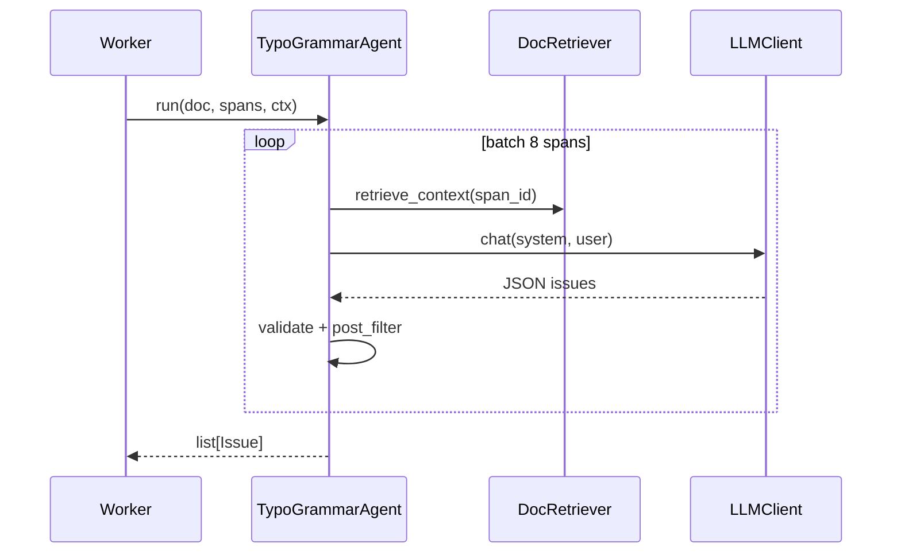

# Agent 实施指南（可分工交付）

> **读者**：负责 Agent-1～5 实现的工程师。  
> **前置**：[backend-api.md](./backend-api.md) Phase 1–3 已完成；先读 [rag-design.md](./rag-design.md)。  
> **原则**：对外 API 不变；通过 `AGENT_MODE` 切换规则 / Agent / 混合模式。

---

## 1. 交付总览

| 里程碑 | 内容 | 验收 |
|--------|------|------|
| **M1** | Agent-1 + RAG-1 消费 + hybrid 模式 | result 含 FORMAT/REFERENCE + span_id |
| **M2** | RAG-2 + Agent-2 | SSE 出现 TYPO/GRAMMAR_CHECK；Issue 含 suggested_text |
| **M3** | Agent-3 | LOGIC_CHECK stage；摘要数值矛盾 span 级 |
| **M4** | Agent-4 + Agent-5 全链路 | SSE 全 stage；POLISH 默认 info |
| **M5** | E2E + 性能 | 样例论文 < 5min；decisions→preview 一致 |

---

## 2. 代码集成点（现有仓库）

| 现有模块 | 路径 | Agent 阶段动作 |
|----------|------|----------------|
| 解析 + Span | `packages/parser/span_builder.py` | 不变 |
| 规则检查 | `packages/checks/*.py` | Agent-1 迁移/包装 |
| 编排 | `packages/orchestrator/runner.py` | hybrid 时并行或前置 |
| Worker | `apps/worker/tasks.py` | 改调 `agent_runner` |
| 进度 SSE | `packages/orchestrator/progress.py` | 各 Agent 上报 DetectStage |
| Issue  enrich | `packages/orchestrator/issue_enricher.py` | Agent 输出后统一 enrich |
| RAG-1 | `packages/rag/rule_retriever.py` | Agent-1 retrieve |
| RAG-2 | 待建 `packages/rag/doc_retriever.py` | Agent-2/3/4 |

---

## 3. 统一接口（必须先实现）

### 3.1 `packages/agents/base.py`

```python
from typing import Protocol, Callable
from schema.models import PaperDocument, Span, Issue, DetectStage

class BaseAgent(Protocol):
    name: str
    stage: DetectStage

    def run(self, doc: PaperDocument, spans: list[Span], ctx: AgentContext) -> list[Issue]:
        ...

@dataclass
class AgentContext:
    task_id: str
    rule_base_id: str
    rule_retriever: RuleRetriever      # 封装 retrieve_rules
    doc_retriever: DocRetriever          # RAG-2
    llm: LLMClient | ModelRouter         # 见 model-finetuning.md FT-6
    publish_progress: Callable[[DetectStage, int, str], None]
    config: AgentPipelineConfig          # 来自 agent_pipeline.yaml
```

### 3.2 Issue 输出约束

每条 Agent 产出 Issue **必须**满足（否则 enrich 失败或 preview 不可用）：

| 字段 | 要求 |
|------|------|
| `id` | UUID，Agent 内生成 |
| `issue_type` | `IssueType` 枚举 |
| `code` | 稳定字符串，如 `TYPO_HOMOPHONE` |
| `severity` | error / warning / info（润色默认 info） |
| `message` | 人类可读说明 |
| `span_id` | 能定位则必填 |
| `original_text` | 与 span.text 或子串一致 |
| `suggested_text` | accept 后写入 preview；无建议则空 |
| `suggestion` | 与 suggested_text 同义，兼容旧字段 |

### 3.3 LLM 输出 JSON Schema（Agent-2/3/4 共用）

```json
{
  "type": "array",
  "items": {
    "type": "object",
    "required": ["span_id", "issue_type", "message", "original_text", "suggested_text"],
    "properties": {
      "span_id": { "type": "string" },
      "issue_type": { "type": "string", "enum": ["typo", "grammar", "polish", "logic_contradiction", "paragraph_logic", "sentence_split"] },
      "severity": { "type": "string", "enum": ["error", "warning", "info"] },
      "code": { "type": "string" },
      "message": { "type": "string" },
      "original_text": { "type": "string" },
      "suggested_text": { "type": "string" },
      "reason": { "type": "string" }
    }
  }
}
```

校验失败：**丢弃该条** + 记录 worker 日志，不 fail 整任务。

---

## 4. Agent-1：格式与引用

**负责人建议**：后端 / 规则工程  
**目录**：`packages/agents/format_agent.py`, `structure_agent.py`, `reference_agent.py`  
**可复用**：`packages/checks/{structure,format,reference}.py`

### 4.1 任务拆分

| ID | 描述 | PRD | 产出 |
|----|------|-----|------|
| A1-1 | 排版规则（字体行距页边距 — 能解析则查，否则 INFO） | 3.1.1 | FORMAT Issue |
| A1-2 | 八大结构模块 | 3.1.2 | 缺 abstract → ERROR |
| A1-3 | 注释规范 | 3.1.3 | FORMAT |
| A1-4 | 字数标准 | 3.1.4 | INFO + 统计 |
| A1-5 | GB/T 7714 正文 `[1]` 标注 | 3.4.2 | REFERENCE |
| A1-6 | 著录格式 [J]/[M] | 3.4.3 | REFERENCE + suggested 著录 |
| A1-7 | 文献列表排序标点 | 3.4.4 | REFERENCE |

### 4.2 RAG 用法

```python
snippets = ctx.rule_retriever.retrieve(
    "参考文献 顺序编码 方括号",
    dimensions=["reference"],
    top_k=3,
)
# 写入 Issue.evidence 或 LLM 补充说明（A1-6 著录改写可选小模型）
```

### 4.3 验收

- [ ] `samples/scut_maker.md` 回归：Issue 数 ≥ 现有 checker
- [ ] 每条 Issue 有 `span_id`（结构类指向 section 首 span）
- [ ] `AGENT_MODE=hybrid` 与纯 rules  diff < 10% issue 数

---

## 5. Agent-2：文本纠错

**负责人建议**：算法 / LLM 工程  
**目录**：`packages/agents/typo_agent.py`, `grammar_agent.py`  
**SSE**：`TYPO_CHECK` → `GRAMMAR_CHECK`

### 5.1 调用流程



### 5.2 Prompt 模板（typo_grammar）

**System**：

```text
你是学术论文错别字与语病纠错助手。只输出 JSON 数组，不要 markdown。
规则：
1. 只修改明确错误，不做润色。
2. 不得修改数字、公式、引用标记如 [1]、DOI、单位。
3. 每条必须包含 span_id、original_text、suggested_text、issue_type(typo|grammar)、message。
```

**User**：

```text
【规范摘录】{rag1_optional}
【上下文】
{retrieve_context 拼接}
【待检 spans JSON】
[{ "span_id": "...", "text": "..." }, ...]
```

### 5.3 后验过滤器 `agents/post_filters.py`

- `original_text` 必须是 span 子串
- `suggested_text` 与 original 数字集合一致
- 引用标记 `\[\d+\]` 集合不变
- 英文缩写 whitelist（ARIMA, CNN, …）不误改

### 5.4 任务与验收

| ID | 任务 | 验收 |
|----|------|------|
| A2-1 | typo batch LLM + schema | fixture 故意别字 → Issue |
| A2-2 | grammar 同上 | 冗余句 → grammar Issue |
| A2-3 | 英文大小写/拼写（en section） | 可选 P2 |
| A2-4 | 超时降级 30s/batch | 跳过 batch + WARNING 日志 |

---

## 6. Agent-3：逻辑纠错

**负责人建议**：算法 + 规则混合  
**目录**：`packages/agents/logic_agent.py`, `formula_checker.py`, `figure_table_checker.py`  
**SSE**：`LOGIC_CHECK`

### 6.1 分工

| 子模块 | 方式 | 说明 |
|--------|------|------|
| A3-1 摘要-正文数值 | 规则（迁移 `ConsistencyChecker._check_abstract_numbers`） | span 级定位 |
| A3-2 语义矛盾 | LLM + RAG-2 全文片段 | claim / evidence JSON |
| A3-3 公式变量 | 规则 PoC | `$\\alpha$` 跨 span 表 |
| A3-4 图表编号 | 规则 | 复用 structure checker |

### 6.2 LLM 输出（logic）

```json
{
  "span_id": "…",
  "issue_type": "logic_contradiction",
  "message": "摘要称提升42.29%，结论段未出现该数据",
  "original_text": "…",
  "suggested_text": "",
  "claim": "摘要：提升42.29%",
  "evidence": "结论段：…"
}
```

### 6.3 验收

- [ ] 样例「摘要含 pcu 正文无」→ LOGIC Issue + span_id
- [ ] degraded 解析质量 → 仅规则 A3-1/A3-4，跳过 LLM

---

## 7. Agent-4：学术润色

**负责人建议**：算法 / LLM  
**目录**：`packages/agents/polish/`（四子模块）  
**SSE**：`POLISH`  
**默认 severity**：`info`

| 模块 | 文件 | issue_type |
|------|------|------------|
| A4-1 语体 | `academic_tone.py` | POLISH |
| A4-2 段落 | `paragraph_logic.py` | PARAGRAPH_LOGIC |
| A4-3 句式 | `sentence_split.py` | SENTENCE_SPLIT |
| A4-4 英文摘要 | `en_abstract.py` | POLISH |

**开关**：`POLISH_ENABLED=false` 时跳过整个 Agent-4。

**约束 Prompt 句**：不得改变观点、数据、结论；仅调整表述。

---

## 8. Agent-5：编排层

**负责人建议**：后端架构  
**文件**：`packages/orchestrator/agent_runner.py`, `config/agent_pipeline.yaml`

### 8.1 环境变量

| 变量 | 值 | 说明 |
|------|-----|------|
| `AGENT_MODE` | `rules` / `agents` / `hybrid` | 默认 `rules` 保持现网 |
| `POLISH_ENABLED` | `true` / `false` | 默认 true |
| `LLM_API_KEY` | — | OpenAI 兼容 |
| `LLM_BASE_URL` | — | 可选代理 |
| `LLM_MODEL` | `qwen-plus` 等 | |

### 8.2 流水线配置

见仓库 `config/agent_pipeline.yaml.example`。

### 8.3 Issue 合并策略

优先级（高 → 低）：`error` severity > typo/grammar > logic > polish/info  
同 `span_id` + 同 `issue_type`：保留 severity 高者；message 合并  
同 `span_id` 不同 type：全部保留

### 8.4 hybrid 模式

```
1. CheckOrchestrator.run → rule_issues
2. agent_runner.run (Agent-1 可跳过若 rules 已覆盖) → agent_issues
3. merge(rule_issues, agent_issues)
4. enrich_issues(merged, doc, spans)
```

### 8.5 验收

- [ ] E2E：上传 → SSE 顺序含 FORMAT…POLISH…DONE
- [ ] `tests/test_agent_runner_e2e.py` mock LLM
- [ ] 生产默认 `AGENT_MODE=rules` 行为不变

---

## 9. LLM 客户端（MVP）

**文件**：`packages/agents/llm_client.py`

```python
class LLMClient:
    def chat(self, messages: list[dict], *, json_mode: bool = True, timeout: float = 60) -> str:
        """OpenAI 兼容 POST /v1/chat/completions"""
```

**重试**：429/5xx 指数退避 2 次；失败返回 `[]` issues。

**ModelRouter**（微调接入）见 [model-finetuning.md](./model-finetuning.md#ft-6推理集成modelrouter)，Agent 只依赖 `ctx.llm.complete(task, messages)`。

---

## 10. 分工矩阵（可直接分配）

| 任务包 | 任务 ID | 预估人天 | 技能 | 依赖 |
|--------|---------|----------|------|------|
| **包 A：基础** | base.py + llm_client + post_filters | 3 | Python | — |
| **包 B：RAG-2** | R2-1～R2-3, R2-8 | 5 | Python | 包 A 可选 |
| **包 C：Agent-1** | A1-1～A1-7 | 8 | 规则+NLP | RAG-1 |
| **包 D：Agent-2** | A2-1～A2-4 | 8 | LLM | 包 A,B |
| **包 E：Agent-3** | A3-1～A3-4 | 10 | 规则+LLM | 包 A,B |
| **包 F：Agent-4** | A4-1～A4-4 | 8 | LLM | 包 A,B |
| **包 G：编排** | Agent-5 + worker 接入 | 5 | 后端 | 包 C～F 部分 |
| **包 H：E2E** | 测试 + 样例回归 | 3 | QA | 包 G |

**建议并行**：C 与 B 并行；D/E/F 在 B 就绪后并行；G 最后集成。

---

## 11. 目录结构（目标）

```
packages/agents/
├── __init__.py
├── base.py
├── llm_client.py
├── model_router.py          # FT-6
├── post_filters.py
├── format_agent.py
├── structure_agent.py
├── reference_agent.py
├── typo_agent.py
├── grammar_agent.py
├── logic_agent.py
├── formula_checker.py
├── figure_table_checker.py
└── polish/
    ├── academic_tone.py
    ├── paragraph_logic.py
    ├── sentence_split.py
    └── en_abstract.py
packages/orchestrator/
└── agent_runner.py
packages/rag/
├── doc_index.py             # RAG-2
└── doc_retriever.py
config/
└── agent_pipeline.yaml
tests/
├── test_agents_typo.py
├── test_agents_logic.py
├── test_doc_retriever.py
└── test_agent_runner_e2e.py
```

---

## 12. 相关文档

- [agent-pipeline.md](./agent-pipeline.md) — 架构总览与 PRD 映射
- [rag-design.md](./rag-design.md) — RAG-1/2 详细设计
- [model-finetuning.md](./model-finetuning.md) — LoRA 与 ModelRouter
- [handoff-checklist.md](./handoff-checklist.md) — 交接检查清单
