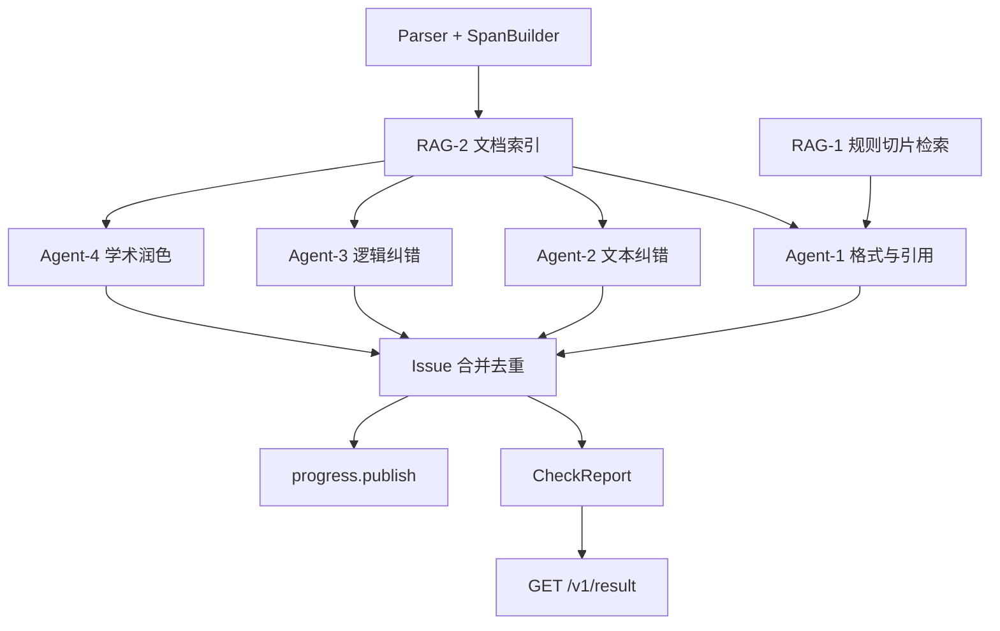
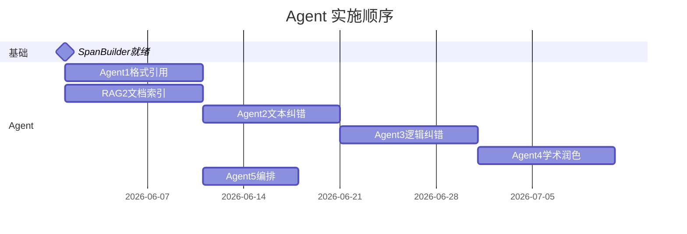

# Agent 流水线计划

> **定位**：论文纠错 **推理层** 独立规划，与 [后端 API 计划](./backend-api.md) 解耦。  
> **依赖**：后端 Phase 1 完成 Issue/Span 模型与 `GET /v1/result` 契约。  
> **模型微调**：见 [model-finetuning.md](./model-finetuning.md)（SFT/LoRA 并行，经 `ModelRouter` 接入）。

## 目标

将现有「四类规则预检查」升级为 PRD 定义的纠错 Agent 流水线：

| PRD 能力 | Agent 包 |
|----------|----------|
| 格式规范校验（3.1） | Agent-1 |
| 全维度纠错（3.2） | Agent-2、Agent-3 |
| 学术润色（3.3） | Agent-4 |
| 参考文献合规（3.4） | Agent-1（引用子模块） |

**MVP 策略**：Agent-2/3/4 先用 **基座 LLM + Prompt**；微调 adapter 就绪后切换，不改 API。

---

## 架构总览



---

## 统一 Agent 接口

**目录** `packages/agents/base.py`

```python
class BaseAgent(Protocol):
    stage: DetectStage  # 对应 SSE stage
    def run(
        self,
        doc: PaperDocument,
        spans: list[Span],
        ctx: AgentContext,
    ) -> list[Issue]: ...

@dataclass
class AgentContext:
    task_id: str
    rule_base_id: str
    rule_retriever: RuleRetriever      # RAG-1
    doc_retriever: DocRetriever        # RAG-2
    llm: ModelRouter | LLMClient       # 见 model-finetuning.md FT-6
    publish_progress: Callable[[str, int, str], None]
```

**输出约束**：每条 Issue 必须含 `id`, `issue_type`, `span_id`（若可定位）, `original_text`, `suggested_text`。

---

## Agent-1：格式与引用（规则 + RAG）

| 项 | 内容 |
|----|------|
| **目录** | `format_agent.py`, `reference_agent.py`, `structure_agent.py` |
| **SSE stage** | `FORMAT_CHECK`, `REFERENCE_CHECK` |
| **Issue 类型** | `FORMAT`, `REFERENCE` |
| **实现** | 迁移增强 `packages/checks/{structure,format,reference}.py` |
| **RAG** | `rule_retriever.retrieve(...)` 检索**规则切片**（非检测本身） |

> **RAG-1 定位**：规范条文切片 + 检索引用，见 [rag-design.md §0](./rag-design.md)。违规判定由 checker/规则引擎完成，不由 RAG 做。

### 子任务拆解

| ID | 子任务 | 来源 | 输出 |
|----|--------|------|------|
| A1-1 | 页面/正文字体行距等排版规则 | PRD 3.1.1 | FORMAT Issue + suggested 排版说明 |
| A1-2 | 八大结构模块完整性 | PRD 3.1.2 | STRUCT → FORMAT |
| A1-3 | 注释规范（篇末/章末/脚注） | PRD 3.1.3 | FORMAT |
| A1-4 | 字数标准（学科/学位） | PRD 3.1.4 | INFO/WARNING |
| A1-5 | GB/T 7714 正文标注 | PRD 3.4.2 | REFERENCE |
| A1-6 | 著录格式与文献类型标识 | PRD 3.4.3 | REFERENCE + suggested 著录 |
| A1-7 | 参考文献列表排序与标点 | PRD 3.4.4 | REFERENCE |

### 任务清单

- [ ] A1-1～A1-4：规则引擎 + span 定位（line → span_id）
- [ ] A1-5～A1-7：扩展 `ReferenceChecker`，RAG 检索国标条文
- [ ] 单元测试：样例论文 `samples/*_maker.md` 回归
- [ ] 与 `AGENT_MODE=hybrid` 下旧 checker 输出对比

---

## Agent-2：文本纠错（LLM）

| 项 | 内容 |
|----|------|
| **目录** | `typo_agent.py`, `grammar_agent.py` |
| **SSE stage** | `TYPO_CHECK`, `GRAMMAR_CHECK` |
| **Issue 类型** | `TYPO`, `GRAMMAR` |

### 子任务拆解

| ID | 子任务 | 说明 |
|----|--------|------|
| A2-1 | 错别字检测 | 中文别字、同音误用 |
| A2-2 | 语病/冗余 | 成分残缺、搭配不当、重复 |
| A2-3 | 英文大小写 | 标题、专有名词、缩写 |
| A2-4 | 英文拼写 | 非中文摘要/正文英文片段 |

### 实现要点

- Batch：按段落或每批 8～16 spans 调用 LLM
- 输出 JSON Schema → Pydantic 校验
- RAG-2：召回 span 前后文 + 术语表（可选）
- 后验：数字、公式、引用标记不得被 suggested 修改

### Prompt 模板（占位）

```
system: 你是学术论文纠错助手，只输出 JSON 数组，每项含 span_id, original_text, suggested_text, issue_type, reason
user: 【上下文】...\n【待检 spans】...
```

### 任务清单

- [ ] A2-1～A2-4 Prompt 模板 + schema
- [ ] batch 推理 + 超时降级（跳过并 INFO）
- [ ] 集成测试：含故意错别字的 span fixture
- [ ] 对接 [FT-2 typo_grammar LoRA](./model-finetuning.md#ft-2错别字--语病-lora--agent-2)（可选）

---

## Agent-3：逻辑纠错（LLM + 规则）

| 项 | 内容 |
|----|------|
| **目录** | `logic_agent.py`, `formula_checker.py`, `figure_table_checker.py` |
| **SSE stage** | `LOGIC_CHECK` |
| **Issue 类型** | `LOGIC_CONTRADICTION` + 图表类 FORMAT |

### 子任务拆解

| ID | 子任务 | 方式 |
|----|--------|------|
| A3-1 | 摘要-正文-结论数值/结论一致性 | 规则 + LLM（增强 ConsistencyChecker） |
| A3-2 | 上下文逻辑矛盾、语义断层 | LLM + RAG-2 全文召回 |
| A3-3 | 公式/符号/变量前后一致 | 规则解析 LaTeX + 跨 span 比对 |
| A3-4 | 图表编号断档、重复、未引用 | 规则（现有 structure 部分） |

### 任务清单

- [ ] A3-1：迁移 `_llm_check`，输出 span 级 Issue
- [ ] A3-2：段落级 LLM，claim/evidence 结构
- [ ] A3-3：公式变量表抽取 PoC
- [ ] A3-4：合并 `STRUCT_FIGURE/TABLE_REF_*` 到 span Issue
- [ ] 对接 [FT-4 logic LoRA](./model-finetuning.md#ft-4逻辑纠错-lora--agent-3)

---

## Agent-4：学术润色（LLM）

| 项 | 内容 |
|----|------|
| **目录** | `polish_agent.py`（可按子任务拆模块） |
| **SSE stage** | `POLISH` |
| **默认 severity** | `info`（建议性，非错误） |

### 子任务拆解（PRD 3.3）

| ID | 子任务 | issue_type | 约束 |
|----|--------|------------|------|
| A4-1 | 语体学术化 | `POLISH` | 不改观点/数据/结论 |
| A4-2 | 段落逻辑优化 | `PARAGRAPH_LOGIC` | 补衔接、调整句序 |
| A4-3 | 句式精简重构 | `SENTENCE_SPLIT` | 长句拆分，可多 suggested |
| A4-4 | 英文摘要润色 | `POLISH`（section=en） | 地道学术英语 |

### 任务清单

- [ ] A4-1～A4-4 独立 system prompt
- [ ] 配置项：`POLISH_ENABLED=true|false`，可按 task 关闭润色以省 token
- [ ] 集成测试：口语句 → 学术 suggested 非空
- [ ] 对接 [FT-3 润色 LoRA](./model-finetuning.md#ft-3学术润色-lora--agent-4-四子任务)

---

## Agent-5：编排层

| 项 | 内容 |
|----|------|
| **目录** | `packages/orchestrator/agent_runner.py` |
| **env** | `AGENT_MODE=rules|agents|hybrid` |

### 职责

1. 按 stage 顺序调度 Agent-1 → 2 → 3 → 4（顺序可配置）
2. `progress.publish` 每个 stage 起止
3. Issue 去重：同 `span_id` 多 Issue 按优先级保留（纠错 > 逻辑 > 润色）
4. 与 `CheckOrchestrator` hybrid：规则先跑，Agent 补充 span 级建议

### 流水线配置示例

```yaml
# config/agent_pipeline.yaml
stages:
  - format_reference   # Agent-1
  - typo_grammar       # Agent-2
  - logic              # Agent-3
  - polish             # Agent-4, optional: true
```

### 任务清单

- [ ] `agent_runner.py` + pipeline yaml
- [ ] Issue merge 策略单元测试
- [ ] Worker `process_paper_job` 接入 runner
- [ ] E2E：上传 → SSE 全 stage → result 含各 issue_type

---

## RAG-2：文档上下文检索

> **与 RAG-1 区别**：RAG-1 = **规范规则切片**（静态）；RAG-2 = **当前论文 Span 上下文**（按 task 临时）。规范检查 Agent-1 主要消费 RAG-1；Agent-2/3/4 主要消费 RAG-2。

| 项 | 内容 |
|----|------|
| **目录** | `packages/rag/doc_index.py`, `doc_retriever.py` |
| **生命周期** | 按 `task_id` 建索引，完成后 TTL 清理 |

### API（内部）

```python
build_task_index(task_id: str, doc: PaperDocument, spans: list[Span]) -> None
retrieve_context(task_id: str, span_id: str, top_k: int = 5) -> list[str]
```

### 索引内容

- 相邻 span（窗口 ±2）
- 同 section 摘要
- 相关公式/图表 caption（关键词匹配）

### 任务清单

- [ ] 内存索引 MVP（万字论文）
- [ ] Agent-2/3/4 prompt 注入 retrieve_context
- [ ] 可选：向量索引升级（与 RAG-1 共用 pgvector/Chroma）

> RAG-1（规范库）详见 [rag-design.md](./rag-design.md)。  
> RAG-2（文档上下文）详见 [rag-design.md#4-rag-2--文档上下文检索](./rag-design.md)。

---

## 实施顺序



**依赖**

1. 后端 Phase 1 Issue/Span 契约
2. RAG-2 与 Agent-2 可并行启动于 SpanBuilder 之后
3. Agent-5 可与 Agent-2/3/4 交叉集成，最终以 E2E 验收
4. 不阻塞 [模型微调](./model-finetuning.md)

---

## 目录结构

```
packages/agents/
├── base.py
├── format_agent.py
├── structure_agent.py
├── reference_agent.py
├── typo_agent.py
├── grammar_agent.py
├── logic_agent.py
├── formula_checker.py
├── figure_table_checker.py
├── polish_agent.py
│   ├── academic_tone.py      # A4-1
│   ├── paragraph_logic.py    # A4-2
│   ├── sentence_split.py     # A4-3
│   └── en_abstract.py        # A4-4
└── model_router.py           # FT-6 接入点
packages/orchestrator/
└── agent_runner.py
packages/rag/
├── doc_index.py
└── doc_retriever.py
config/
└── agent_pipeline.yaml
tests/
├── test_agents_typo.py
├── test_agents_logic.py
└── test_agent_runner_e2e.py
```

---

## 风险与应对

| 风险 | 应对 |
|------|------|
| LLM 幻觉修改数据 | 后验规则 + suggested 与 original diff 审校 |
| Token 成本 | span batch、跳过润色开关、RAG-2 限上下文 |
| 与规则 checker 重复 Issue | Agent-5 merge + 同 span 去重 |
| 延迟 | stage 并行度仅只读 Agent 间有限并行（Phase 2 后评估） |

---

## 相关文档

- [agent-implementation-guide.md](./agent-implementation-guide.md) — **可分工实施指南**
- [rag-design.md](./rag-design.md) — RAG-1/2 设计
- [handoff-matrix.md](./handoff-matrix.md) / [handoff-checklist.md](./handoff-checklist.md) — 分工与验收
- [model-finetuning.md](./model-finetuning.md) — LoRA 与 ModelRouter
