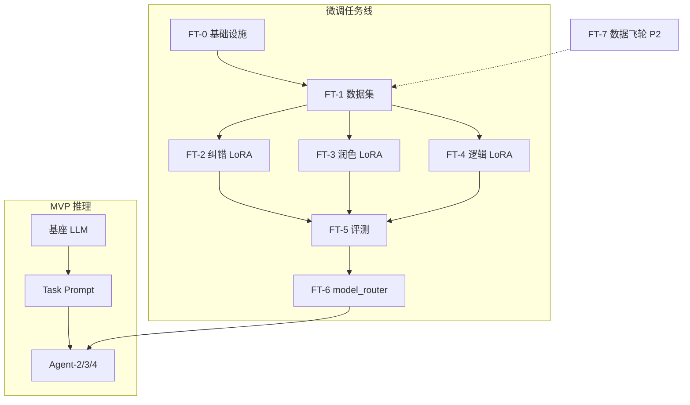
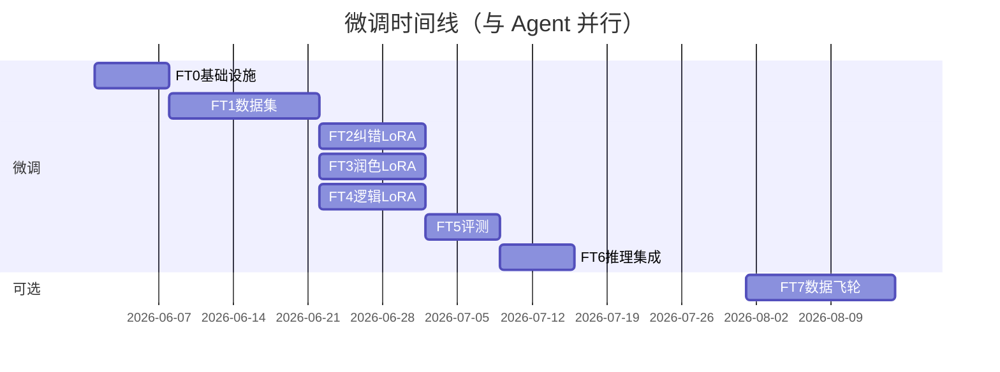

# 模型微调计划（SFT / LoRA）

> **定位**：与 [Agent 流水线](./agent-pipeline.md) **并行**的独立工作线。  
> **原则**：MVP 推理用基座 + Prompt；微调 adapter 经 `ModelRouter` 热切换，**不改** [后端 API](./backend-api.md) 契约。

## 目标

为论文纠错场景训练领域 LoRA adapter，提升 Agent-2（纠错）、Agent-3（逻辑）、Agent-4（润色）相对「基座 + Prompt」的准确率与稳定性。

**不微调**：Agent-1 格式/引用（规则 + RAG 为主）。

---

## 总体策略



| 原则 | 说明 |
|------|------|
| 分任务 adapter | 纠错 / 润色 / 逻辑 至少 3 个 LoRA |
| 评测门禁 | FT-5 未超基线 → 不上线 |
| 可降级 | adapter 失败 → 基座 Prompt |
| 与 Agent 解耦 | Agent Prompt/schema 不变，仅换 `ctx.llm` 后端 |

---

## FT-0：微调基础设施

### 目录

```
training/
├── configs/                 # 各任务 YAML
├── scripts/
│   ├── train_lora.py        # 统一训练入口
│   ├── merge_adapter.py     # 可选：合并权重
│   └── export_gguf.py       # 可选：边缘部署
├── adapters/                # 产出物（gitignore 大文件）
├── data/                    # 数据集（gitignore 或 LFS）
├── eval/
└── requirements-train.txt   # 与 runtime 依赖隔离
```

### 技术选型

| 项 | 建议 |
|----|------|
| 框架 | LLaMA-Factory 或 peft + transformers + trl |
| 方法 | QLoRA（4bit 基座 + LoRA） |
| 基座 | Qwen2.5-7B-Instruct 等（部署前评测选定） |
| rank | 8～64，按任务在 config 中指定 |

### 任务清单

- [ ] `requirements-train.txt` + README
- [ ] `train_lora.py` 读取 YAML config 一键训练
- [ ] adapter 版本命名：`{task}_v{semver}` + manifest.json（基座、数据版本、指标）
- [ ] Makefile 或 `justfile`：`train-typo`, `eval-typo`

---

## FT-1：数据集构建与标注规范

### 统一 JSONL Schema

```json
{
  "id": "uuid",
  "task": "typo_grammar | polish | logic | en_abstract",
  "issue_type": "TYPO",
  "input": {
    "span_text": "以经过实验验证",
    "context_before": "...",
    "context_after": "...",
    "section_kind": "abstract"
  },
  "output": {
    "original_text": "以经过实验验证",
    "suggested_text": "已经过实验验证",
    "reason": "错别字：以经 → 已经"
  },
  "meta": {
    "discipline": "工科",
    "degree": "硕士",
    "source": "human|distill|feedback"
  }
}
```

### 分任务数据集

| 文件 | 对接 Agent | 初版规模 | 来源 |
|------|-----------|----------|------|
| `typo_grammar.jsonl` | Agent-2 | 5k～20k | 开源纠错语料 + 论文章节蒸馏 + 人工抽检 |
| `polish_academic.jsonl` | Agent-4a | 3k～10k | 口语↔学术配对 |
| `polish_paragraph.jsonl` | Agent-4b | 2k～5k | 段落衔接改写 |
| `polish_sentence_split.jsonl` | Agent-4c | 2k～5k | 长句拆分配对 |
| `polish_en_abstract.jsonl` | Agent-4d | 1k～3k | 中英摘要、中式英语修正 |
| `logic_consistency.jsonl` | Agent-3 | 2k～8k | 矛盾句对、摘要-正文不一致 |

### 质检

- train / val / test = 8 : 1 : 1
- **test 集冻结**，仅 FT-5 使用
- 10% 人工复核；MinHash 去重
- 交付：`training/data/README.md` + 统计脚本

### 任务清单

- [ ] 标注规范文档（与 Agent Issue schema 对齐）
- [ ] 开源语料清洗脚本
- [ ] LLM 蒸馏 pipeline（teacher 生成 → 人工抽检）
- [ ] 六类数据集 v0.1

---

## FT-2：错别字 / 语病 LoRA → Agent-2

| 项 | 内容 |
|----|------|
| **config** | `training/configs/typo_grammar.yaml` |
| **SFT 格式** | Chat：system=纠错规则；user=上下文+spans；assistant=JSON |
| **超参起点** | rank=16, alpha=32, lr=2e-4, epochs=3, max_seq=2048 |
| **指标** | 字级 F0.5；句级 exact match；数字/公式/实体保留率 100% |
| **产出** | `adapters/typo_grammar_v1/` |

### 任务清单

- [ ] 训练 config + 首次训练 run
- [ ] FT-5 对比基座 Prompt
- [ ] 失败案例分析文档

---

## FT-3：学术润色 LoRA → Agent-4 四子任务

**策略**：v1 单 adapter + 4 套 system prompt；数据充足后拆 4 个 LoRA。

| 子任务 | issue_type | 数据集 | Prompt 约束 |
|--------|------------|--------|-------------|
| 4a 语体 | `POLISH` | polish_academic | 不改观点/数据 |
| 4b 段落 | `PARAGRAPH_LOGIC` | polish_paragraph | 仅衔接/句序 |
| 4c 句式 | `SENTENCE_SPLIT` | polish_sentence_split | 语义保留 |
| 4d 英文摘要 | `POLISH` | polish_en_abstract | 学术英语 |

| 项 | 内容 |
|----|------|
| **指标** | 人工 Likert 学术度 ≥ 基线；实体保留率 100% |
| **产出** | `adapters/polish_v1/` |

### 任务清单

- [ ] 合并训练集或分任务 weighted mix
- [ ] 4 套 eval prompt 分项评测
- [ ] v2 评估是否拆 4 adapter

---

## FT-4：逻辑纠错 LoRA → Agent-3

| 项 | 内容 |
|----|------|
| **训练目标** | 摘要/结论/实验片段 → 矛盾列表或「无问题」 |
| **输出 schema** | 对齐 `LOGIC_CONTRADICTION`：claim, reason, evidence |
| **与规则分工** | 公式/图表编号仍规则；LoRA 做语义矛盾 |
| **指标** | 召回率、误报率；vs ConsistencyChecker LLM A/B |
| **产出** | `adapters/logic_v1/` |

### 任务清单

- [ ] logic_consistency 数据集 v0.1
- [ ] 训练 + FT-5 评测
- [ ] Agent-3 A3-2 集成验证

---

## FT-5：评测基准（Eval Harness）

### 目录 `training/eval/`

| 组件 | 说明 |
|------|------|
| `holdout_test/` | 各任务冻结测试集 |
| `eval_runner.py` | `baseline` vs `adapter_vN` 一键报告 |
| `metrics/` | P/R/F1 per issue_type、latency、token 成本 |
| **门禁** | 核心指标 ≤ 基线 → 禁止 FT-6 上线 |

### 任务清单

- [ ] eval_runner CLI
- [ ] 报告模板 `eval/reports/{adapter}_{date}.md`
- [ ] 可选：CI weekly regression job

---

## FT-6：推理集成（ModelRouter）

### 目录 `packages/agents/model_router.py`

```python
class ModelRouter:
    def complete(self, task: AgentTask, messages: list[dict]) -> str:
        adapter = self._resolve_adapter(task)
        if adapter and settings.ft_enabled:
            return self._client.chat(messages, lora_adapter=adapter)
        return self._client.chat(messages)
```

### 环境变量

| 变量 | 说明 |
|------|------|
| `FT_ENABLED` | `true` / `false` |
| `FT_ADAPTER_TYPO` | 纠错 adapter 路径 |
| `FT_ADAPTER_POLISH` | 润色 adapter 路径 |
| `FT_ADAPTER_LOGIC` | 逻辑 adapter 路径 |
| `LLM_BASE_MODEL` | 基座模型 ID 或路径 |

### AgentTask → adapter 映射

| AgentTask | adapter |
|-----------|---------|
| typo, grammar | FT_ADAPTER_TYPO |
| polish, paragraph_logic, sentence_split, en_abstract | FT_ADAPTER_POLISH |
| logic | FT_ADAPTER_LOGIC |

### 任务清单

- [ ] ModelRouter 实现 + 单元测试（mock client）
- [ ] AgentContext 注入 router
- [ ] 集成测试：FT_ENABLED=false/true 行为一致 schema
- [ ] 显存策略：按 stage 加载/卸载 adapter

---

## FT-7：数据飞轮（P2）

**触发条件**：[后端 Phase 3](./backend-api.md) 决策 API 上线。

| 步骤 | 说明 |
|------|------|
| 采集 | accept→正样本；reject→负样本；custom→改写样本 |
| 脱敏 | 去作者/机构；用户 opt-in |
| 增量训练 | 月度 merge FT-1；小 lr 续训或 DPO |
| 版本 | adapter semver + FT-5 回归 |

### 任务清单

- [ ] 反馈导出脚本 `training/scripts/export_feedback.py`
- [ ] DPO 数据格式定义（可选）
- [ ] 运维 runbook：重训 → 评测 → 切换 adapter 版本

---

## 实施时间线



**关键路径**：FT-1 → FT-2/3/4 可并行 → FT-5 门禁 → FT-6。Agent E2E **不等待** FT-6。

---

## 风险与应对

| 风险 | 应对 |
|------|------|
| 过拟合 / 灾难性遗忘 | 分任务 adapter；保留基座降级 |
| 标注不足 | 蒸馏 + 开源语料；FT-7 持续补充 |
| 显存 OOM | QLoRA 4bit；串行加载 adapter |
| 评测与线上分布偏移 | 定期用真实论文 holdout；FT-7 闭环 |
| 训练/runtime 依赖冲突 | 独立 `requirements-train.txt`、Docker 训练镜像 |

---

## 相关文档

- [agent-implementation-guide.md](./agent-implementation-guide.md) — Agent 实施与 LLM 接入点
- [rag-design.md](./rag-design.md) — RAG 与 Prompt 上下文
- [handoff-matrix.md](./handoff-matrix.md) — 微调任务与 Agent 并行排期
- [backend-api.md](./backend-api.md) — API 与决策数据（FT-7 数据源）
- [agent-pipeline.md](./agent-pipeline.md) — Agent 子任务与 Prompt schema（训练目标对齐）
