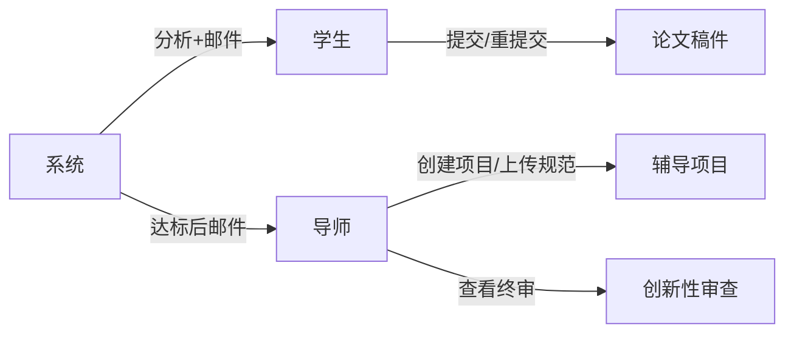
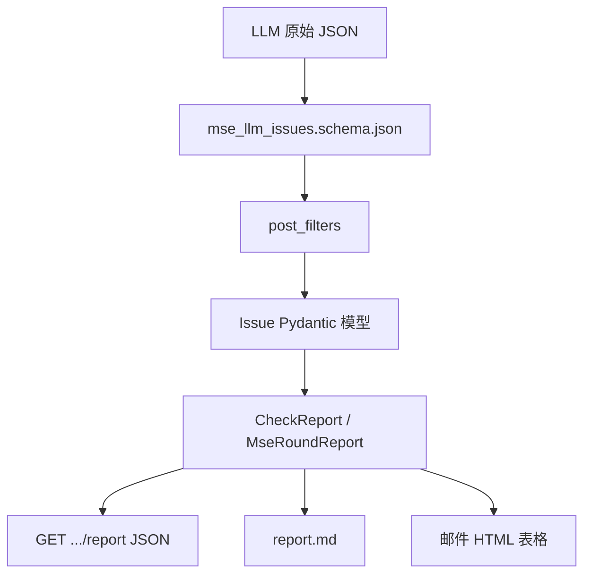
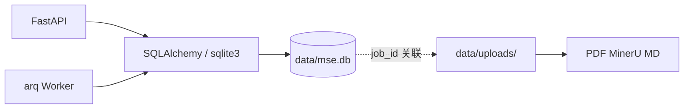
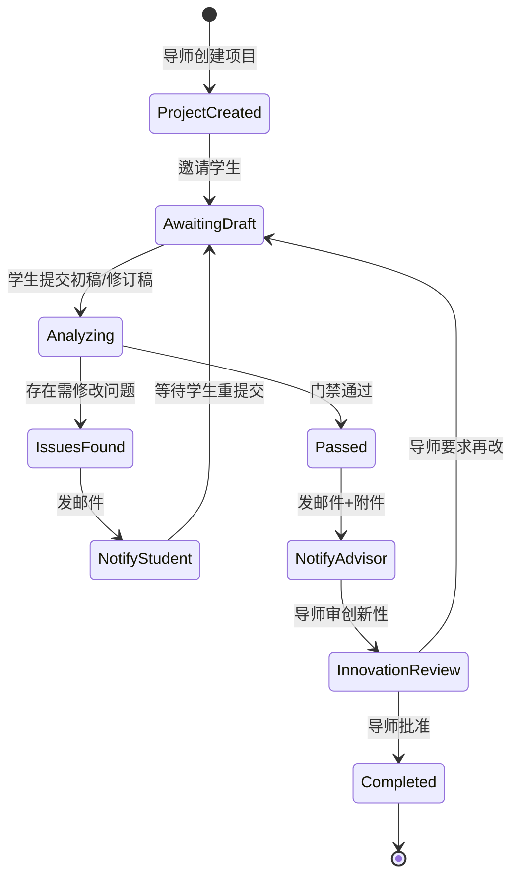
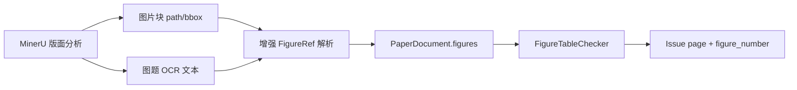

# 硕士学位论文辅导系统 — 实施计划

> **分支**：`mse-tyrion`  
> **用户角色**：导师（主用户）、学生（被辅导对象）  
> **定位**：在现有论文预检查 Agent 基础上，扩展为「多轮修订 + 邮件通知 + 导师终审」的闭环辅导系统。

---

## 1. 业务目标

导师创建辅导任务并上传规范文档（学位论文格式要求、学院细则等）。学生提交初稿后，系统自动：

1. 对照规范文档与论文内容，由大模型分析并指出问题；
2. 将问题**定位到页码**并给出具体描述与修改建议；
3. **发邮件**通知学生修改；
4. 学生改稿后再次提交，重复上述流程；
5. 当系统判定「基本无问题」时，**发邮件**将最新版论文与审查摘要发给导师；
6. 导师审核论文**创新性**并给出最终意见。

---

## 2. 与现有系统的关系

| 现有能力 | 复用方式 |
|----------|----------|
| PDF/MD 双源解析 (`packages/parser`) | **MinerU 解析 PDF/图片** → MD → DualSourceFusion → Span |
| PDF/图片转换 (`apps/worker/converter.py`, `docker/mineru/`) | MSE **必选** MinerU；生产禁用 mock |
| Span 定位 + Issue 模型 (`packages/schema`) | 扩展 `page` 字段，Issue 输出带页码 |
| 四类规则检查 + Agent 流水线 | 作为「对照分析」的第一层（格式/引用/结构） |
| RAG-1 规则检索 (`packages/rag`) | 检索上传的规范文档切片，供 LLM 引用 |
| JWT 认证 + 任务存储 | 扩展为多角色、多轮次模型 |
| Next.js 前端 (`apps/web-next`) | 新增导师/学生视图与修订历史 |

**新增模块**：

- `packages/mse/` — 辅导域模型、修订轮次 FSM、门禁判定
- `packages/notify/` — 邮件发送（SMTP / SendGrid / 阿里云邮件）
- `packages/agents/llm_client.py` — 统一 LLM 客户端（**DeepSeek**）
- `packages/agents/mse_review_agent.py` — 对照规范分析 Agent
- `packages/agents/innovation_agent.py` — 导师侧创新性审查 Agent

---

## 2.1 LLM 方案：DeepSeek

系统统一使用 **DeepSeek** OpenAI 兼容 API，经共享 `LLMClient` 调用：

| Agent | 模型 | 用途 |
|-------|------|------|
| MseReviewAgent | `deepseek-chat` | 对照规范文档，输出带页码 Issue |
| InnovationAgent | `deepseek-chat` / `deepseek-reasoner` | 创新性预审摘要 |
| ConsistencyChecker | `deepseek-chat` | 摘要-正文一致性（迁移至 LLMClient） |

```bash
LLM_PROVIDER=deepseek
LLM_API_KEY=sk-...
LLM_BASE_URL=https://api.deepseek.com/v1
LLM_MODEL=deepseek-chat
LLM_MODEL_REASONING=deepseek-reasoner
```

未配置 `LLM_API_KEY` 时规则层照常运行，Agent 跳过，邮件闭环不阻断。长论文 MseReviewAgent 按章节分批调用以控制 token。

---

## 2.2 论文解析：MinerU（PDF / 图片）

学生提交的论文**必须是 PDF 或图片**，统一经 **MinerU** 解析为 Markdown，**不可直接上传 `.md` 跳过解析**（与现有 `/v1/papers` 的 MD 直传路径区分）。

| 上传格式 | 扩展名 | 处理 |
|----------|--------|------|
| PDF | `.pdf` | MinerU → `paper_mineru.md` |
| 图片 | `.jpg`, `.jpeg`, `.png`, `.tiff`, `.webp` | MinerU OCR + 版面分析 |
| 多页图片 | `.zip`（仅图片） | 解压按页序送 MinerU，合并 MD |

**解析主源**：MinerU（尤其扫描 PDF、图片论文）；Maker 为 PDF 文字版可选辅源。页码映射优先读 MinerU 分页标记。

**部署要求**：`PDF_CONVERTER_MODE=docker`，`MINERU_IMAGE` 必填；MinerU 失败则任务 `failed`，**不回退 mock 样例**。

**Worker 链路**：`process_mse_round` → MinerU 转换 → `DualSourceFusionParser` → 检查 + Agent → 门禁 → 邮件。

---

## 3. 角色与权限



| 角色 | 能力 |
|------|------|
| **导师** | 注册/登录；创建辅导项目；邀请或绑定学生；上传规范文档（PDF/Word/MD）；查看各轮审查报告；接收「待终审」邮件；提交创新性评价 |
| **学生** | 通过邀请链接注册/绑定；上传初稿及修订稿；查看带页码的问题清单；接收修改通知邮件 |
| **系统** | 自动触发分析流水线；判定是否进入下一轮或送审导师；发送邮件 |

### 3.1 角色模型与鉴权（M0 实现）

> **现状**：现有 [`User`](../packages/storage/users.py) **尚无** `role` 字段，注册不区分角色。MSE 在 M0 扩展并在 API 层强制校验。

#### 用户表 `users.role`

| role | 说明 | 注册方式 |
|------|------|----------|
| `advisor` | 导师，默认创建项目 | `/v1/auth/register` 传 `role=advisor` 或默认 |
| `student` | 学生，提交改稿 | 注册时 `role=student`，或**邀请链接**首次上传时自动创建并绑定 |

`UserPublic` / JWT：登录后 `/v1/auth/me` 返回 `role`；JWT payload 含 `role`（与 `sub` 一并解码）。

#### 项目成员关系（双向发起）

- `mse_projects.initiator_role` → `advisor` | `student`
- `mse_projects.advisor_id` / `advisor_email` → 导师（学生发起时 `advisor_id` 可为 NULL 直到接受邀请）
- `mse_projects.student_id` / `student_email` → 学生（导师发起时 `student_id` 可为 NULL）
- `mse_projects.auto_notify_student` → 默认 `true`；`false` 时分析完成后进入 `pending_release`，导师 `POST .../release` 后再通知学生

**成员判定**：用户是项目导师 **或** 是 `student_id` **或** 持有有效 `invite_token`（仅提交接口）。

#### API 权限矩阵（RBAC）

| 接口 | advisor | student | invite-token |
|------|---------|---------|--------------|
| GET `/v1/mse/dashboard` | 导师视图 | 学生视图 | — |
| POST `/v1/mse/projects` | 允许（填 `student_email`） | 允许（填 `advisor_email`） | — |
| POST `.../accept` | 接受学生发起的邀请 | 接受导师发起的邀请 | — |
| POST `.../rules` 上传规范 | 允许 | 403 | — |
| POST `.../invite` | 允许（缺 student 时） | 允许（缺 advisor 时） | — |
| POST `.../submissions` 提交论文 | 403 | 允许（已绑定项目） | 允许（免登录） |
| GET `.../rounds/{n}/report` | 允许 | 允许（`pending_release` 时 403） | 403 |
| GET `.../rounds/{n}/diff` | 允许 | 允许 | 403 |
| POST `.../issues/{fp}/dismiss` | 允许 | 403 | — |
| POST `.../release` | 允许 | 403 | — |
| POST `.../retry` | 允许 | 允许 | — |
| POST `.../innovation-review` | 允许 | 403 | — |
| GET `/v1/mse/projects` 列表 | 自己的 `advisor_id` 项目 | 自己的 `student_id` 项目 | — |

鉴权函数（M3）：

- `assert_project_advisor(project, user)` — 导师专属操作
- `assert_project_member(project, user)` — 导师或已绑定学生
- `assert_invite_token(token, project_id)` — 学生免登录提交

#### 邀请链接（学生免注册可选路径）

1. 导师 `POST .../invite` → 生成 token，邮件含链接 `/mse/invite/{token}`
2. 学生打开链接 → 可注册/登录 **或** 直接上传（首次上传绑定 `student_id` + `student_email`）
3. token 用过后失效或绑定单一学生

#### 与旧版 `/v1/papers` 的关系

- 旧接口：任意登录用户上传自检，**无角色**
- MSE 接口：`/v1/mse/*` **必须**走角色 + 项目成员校验；两套 API 并存

### 3.2 核心闭环（已实现）

| 能力 | 实现 |
|------|------|
| Issue 跨轮 diff | `packages/mse/issue_diff.py` + `GET .../diff` |
| 导师 dismiss 误报 | `mse_issue_dismissals` + `POST .../dismiss` |
| 解析/分析失败重试 | `ReviewStatus.parse_failed/analysis_failed` + `MINERU_MAX_RETRIES` + `POST .../retry` |
| 导师预审发布 | `auto_notify_student=false` → `pending_release` → `POST .../release` |
| 仪表盘 | `GET /v1/mse/dashboard` + 前端 `/mse/dashboard` |

---

## 4. 核心数据模型

### 4.1 辅导项目 `TutoringProject`

```python
class TutoringProject(BaseModel):
    id: str
    advisor_id: str
    title: str                    # 如「2026 届硕士论文辅导 — 张三」
    student_id: str | None        # 绑定后填入
    student_email: str
    rule_base_ids: list[str]      # 关联上传的规范文档（RAG 索引）
    status: ProjectStatus         # draft | active | awaiting_advisor | completed | archived
    current_round: int = 0
    created_at: str
    updated_at: str
```

### 4.2 提交轮次 `SubmissionRound`

```python
class SubmissionRound(BaseModel):
    id: str
    project_id: str
    round_number: int             # 1=初稿, 2=一修, ...
    job_id: str                   # 关联现有 JobRecord（解析+检查）
    file_paths: dict[str, str]    # maker/mineru/pdf
    review_status: ReviewStatus   # pending | analyzing | issues_found | passed | failed
    issue_count: int = 0
    error_count: int = 0
    submitted_at: str
    analyzed_at: str | None
```

### 4.3 扩展 Issue — 页码定位

在现有 `Issue` 上增加：

```python
class Issue(BaseModel):
    # ... 现有字段 ...
    page: int | None = None           # PDF 页码（1-based）
    page_line: str | None = None      # 如 "第 12 页第 3 段"
    rule_ref: str | None = None       # 引用的规范条文 ID/摘要
    revision_hint: str = ""           # 给学生的修改指引
```

**页码映射**：解析阶段从 PDF 元数据或 maker 分页标记建立 `line → page` 映射表，Issue enricher 回填 `page`。

### 4.4 门禁判定 `GateDecision`

```python
class GateDecision(BaseModel):
    round_id: str
    passed: bool
    reason: str
    thresholds: dict[str, int]    # max_errors=0, max_warnings=5 等
    notify_target: Literal["student", "advisor"]
```

### 4.5 创新性审查 `InnovationReview`

```python
class InnovationReview(BaseModel):
    id: str
    project_id: str
    round_id: str                 # 送审时的最终轮次
    llm_summary: str              # Agent 生成的创新性摘要
    novelty_score: float | None   # 0-1 或 1-5
    comparison_notes: str         # 与领域现状对比
    advisor_comment: str = ""     # 导师人工评语
    advisor_decision: Literal["approve", "revise", "reject"] | None
    reviewed_at: str | None
```

### 4.6 分析输出数据规范（格式化规定）

分析结果经 **四层格式约束**，自内向外统一，API/邮件/导出均从同一 `CheckReport` 衍生。



| 层级 | 规范 | 文件/位置 |
|------|------|-----------|
| **L1 LLM 输出** | JSON Schema 校验 | [`docs/plans/schemas/mse_llm_issues.schema.json`](./schemas/mse_llm_issues.schema.json)（见 [mse-prompt-design.md](./mse-prompt-design.md) §7） |
| **L2 领域模型** | Pydantic `Issue` 扩展字段 | [`packages/schema/models.py`](../packages/schema/models.py) |
| **L3 轮次报告** | `MseRoundReport`（MSE 专用，包装 CheckReport + 门禁） | `packages/mse/models.py`（M0 新建） |
| **L4 API 响应** | `ApiResponse[MseRoundReport]` 或裸 `CheckReport` JSON | [`packages/schema/api_response.py`](../packages/schema/api_response.py) |

#### `Issue` 字段规范（MSE 输出必填/可选）

| 字段 | 类型 | 必填 | 说明 |
|------|------|------|------|
| `id` | string (UUID) | 是 | enrich 阶段生成 |
| `code` | string | 是 | 稳定码，如 `FORMAT_FIGURE_MISSING_CAPTION` |
| `issue_type` | enum | 是 | format / reference / logic_* |
| `severity` | error/warning/info | 是 | 门禁统计依据 |
| `category` | CheckCategory | 是 | 与现有 checker 一致 |
| `page` | int | MSE **推荐必填** | 1-based PDF 页码 |
| `page_line` | string | 否 | 展示用，如「第 12 页第 3 段」 |
| `section` | string | 是 | 章节名 |
| `block_id` / `span_id` | string | 否 | 定位到块 |
| `message` | string | 是 | 问题描述（20–120 字） |
| `revision_hint` | string | MSE **推荐必填** | 给学生修改建议 |
| `rule_ref` | string | LLM Issue 必填 | 规范条文 id |
| `original_text` | string | 是 | 原文片段 |
| `suggestion` / `suggested_text` | string | 否 | 兼容旧字段 |
| `evidence` | string | 否 | 规则层证据 |

#### `MseRoundReport`（API 返回体，M0 定义）

```python
class MseRoundReport(BaseModel):
    project_id: str
    round_number: int
    job_id: str
    review_status: ReviewStatus
    gate: GateDecision | None          # 门禁判定
    report: CheckReport                # issues + summary
    innovation_preview: InnovationReview | None  # 仅 passed 轮次可能有
    analyzed_at: str
```

**API 示例**（`GET /v1/mse/projects/{id}/rounds/{n}/report`）：

```json
{
  "project_id": "...",
  "round_number": 1,
  "review_status": "issues_found",
  "gate": { "passed": false, "reason": "error_count=2", "notify_target": "student" },
  "report": {
    "job_id": "...",
    "summary": { "errors": 2, "warnings": 5, "infos": 1 },
    "issues": [
      {
        "id": "...",
        "code": "FORMAT_MISSING_KEYWORDS",
        "page": 1,
        "section": "摘要",
        "message": "摘要后未检测到关键词",
        "revision_hint": "在摘要后添加「关键词：」并列出3-5个关键词",
        "rule_ref": "RULE-ABSTRACT-002",
        "severity": "error",
        "original_text": "摘 要：本文……"
      }
    ]
  }
}
```

#### 衍生格式

| 出口 | 格式 | 说明 |
|------|------|------|
| REST API | JSON（UTF-8，`model_dump(mode="json")`） | 主消费端 |
| Markdown | `{job_id}.report.md` | 复用 `report_to_markdown()`，增加 page/rule_ref 列 |
| 邮件 | HTML 表格 | 列：页码 \| 章节 \| 问题 \| 修改建议 |
| 前端 | TypeScript `Issue` 类型扩展 | `apps/web-next/src/lib/types.ts` |

---

### 4.7 持久化：SQLite 数据库设计（MVP）

> **结论**：**SQLite 够用**。单节点部署、导师+学生并发低、数据量在百级项目/千级 Issue，SQLite（WAL 模式）可满足 MVP；大文件（PDF/MD）仍放文件系统。

#### 为何选 SQLite（而非 PostgreSQL / 纯 JSON）

| 因素 | SQLite | 纯 JSON 文件 |
|------|--------|--------------|
| 多轮/多项目查询 | SQL 列表、筛选、排序 | 需全量扫描 |
| Issue 按页码/章节统计 | `mse_issues` 索引 | 解析嵌套 JSON |
| 事务与一致性 | 项目+轮次+Issue 原子写入 | 多文件易不一致 |
| 部署 | 单文件 `data/mse.db`，无额外服务 | 最简单 |
| 作业/MVP 规模 | 足够 | 够用但难扩展 |

**不适用 SQLite 的信号**（后续再迁 PostgreSQL）：多 API 实例写同一库、>100 并发写、库文件 >10GB。

#### 架构



- **Redis**：仍仅 arq 任务队列
- **文件系统**：`data/uploads/{job_id}/` 存 PDF、MinerU 产出；RAG 索引 `data/rag/mse/`
- **环境变量**：`MSE_DATABASE_URL=sqlite:///data/mse.db`（默认）

#### 表结构（M0 建表）

**users**（自 `users.json` 迁移，M0 双写后切 SQLite）

| 列 | 类型 | 说明 |
|----|------|------|
| id | TEXT PK | UUID |
| email | TEXT UNIQUE | |
| name | TEXT | |
| password_hash | TEXT | |
| role | TEXT | advisor / student |
| created_at | TEXT ISO | |

**mse_projects**

| 列 | 类型 | 说明 |
|----|------|------|
| id | TEXT PK | |
| advisor_id | TEXT FK → users | |
| student_id | TEXT FK → users NULL | 绑定后填 |
| student_email | TEXT | 邀请用 |
| title | TEXT | |
| status | TEXT | draft/active/analyzing/… |
| current_round | INTEGER | |
| created_at / updated_at | TEXT | |

**mse_submission_rounds**

| 列 | 类型 | 说明 |
|----|------|------|
| id | TEXT PK | |
| project_id | TEXT FK | |
| round_number | INTEGER | UNIQUE(project_id, round_number) |
| job_id | TEXT FK → jobs | |
| review_status | TEXT | |
| error_count / warning_count / issue_count | INTEGER | 门禁统计冗余 |
| gate_passed | INTEGER | 0/1 |
| gate_reason | TEXT | |
| notify_target | TEXT | student/advisor |
| submitted_at / analyzed_at | TEXT | |

**jobs**（MSE 新任务统一入库；旧 JSON JobStore 可逐步迁移）

| 列 | 类型 | 说明 |
|----|------|------|
| id | TEXT PK | job_id |
| user_id | TEXT | 提交者 |
| status | TEXT | queued/…/done/failed |
| filename | TEXT | |
| journal_profile | TEXT | 规范 profile id |
| report_json | TEXT | **CheckReport 整包 JSON** |
| progress_json | TEXT | stage/percent/message |
| error | TEXT NULL | |
| created_at / updated_at | TEXT | |

> `document` / `spans` 体积大，MVP **不入库**，需要时从 `uploads` 重新解析或仅缓存 `report_json`。

**mse_issues**（Issue 规范化存储，便于邮件/API 按页查询）

| 列 | 类型 | 说明 |
|----|------|------|
| id | TEXT PK | |
| round_id | TEXT FK | |
| job_id | TEXT FK | 冗余便于 join |
| code | TEXT | |
| severity | TEXT | error/warning/info |
| issue_type | TEXT | |
| category | TEXT | |
| page | INTEGER NULL | 索引 |
| section | TEXT | |
| block_id / span_id | TEXT NULL | |
| message | TEXT | |
| revision_hint | TEXT | |
| rule_ref | TEXT NULL | |
| original_text | TEXT | |
| created_at | TEXT | |

索引：`idx_issues_round(round_id)`、`idx_issues_page(round_id, page)`、`idx_issues_severity(round_id, severity)`。

**mse_innovation_reviews**

| 列 | 类型 | |
|----|------|--|
| id | TEXT PK | |
| project_id | TEXT FK UNIQUE | 每项目一条活跃记录 |
| round_id | TEXT FK | |
| llm_summary | TEXT | |
| novelty_score | REAL | |
| comparison_notes | TEXT | |
| strengths_json / weaknesses_json | TEXT | JSON 数组 |
| advisor_comment | TEXT | |
| advisor_decision | TEXT NULL | approve/revise/reject |
| reviewed_at | TEXT NULL | |

**mse_invite_tokens**

| 列 | 类型 | |
| token | TEXT PK | |
| project_id | TEXT FK | |
| expires_at | TEXT | |
| used_at | TEXT NULL | |

**mse_rule_documents**（规范文件元数据，正文/RAG 在磁盘）

| 列 | 类型 | |
| id | TEXT PK | |
| project_id | TEXT FK | |
| filename | TEXT | |
| storage_path | TEXT | |
| indexed_at | TEXT NULL | |

#### 代码布局

```
packages/storage/
  db.py              # engine、Session、init_db()
  models_orm.py      # SQLAlchemy 表定义
  mse_repository.py  # TutoringProject / Round / Issue CRUD
  jobs_repository.py # Job + report_json（替代或包装 JobStore）
migrations/          # 可选 Alembic；MVP 可用 init_db() CREATE IF NOT EXISTS
data/
  mse.db             # SQLite 文件（.gitignore）
  uploads/           # 不变
```

依赖：`sqlalchemy>=2.0`（或标准库 `sqlite3` + 手写 SQL，推荐 SQLAlchemy 与 Pydantic 互转）。

#### 写入流程（一轮分析完成）

1. Worker 更新 `jobs.status`、`jobs.report_json`
2. 解析 `report.issues` → **批量 INSERT `mse_issues`**
3. 更新 `mse_submission_rounds`（counts、gate、review_status）
4. 更新 `mse_projects.status`、`current_round`
5. 同一 **transaction** 提交

#### 与 API 的对应

| API | 查询 |
|-----|------|
| `GET /v1/mse/projects` | `SELECT * FROM mse_projects WHERE advisor_id=?` |
| `GET .../rounds/{n}/report` | join rounds + jobs.report_json + 或 `SELECT * FROM mse_issues WHERE round_id=? ORDER BY page` |
| 邮件模板 | `SELECT page, section, message, revision_hint FROM mse_issues WHERE round_id=? AND severity IN ('error','warning')` |

`MseRoundReport`（§4.6）由 repository 组装，**API 契约不变**。

#### 迁移策略

| 阶段 | 动作 |
|------|------|
| M0 | 建库 + MSE 表；users 仍可读 `users.json`，写入 SQLite |
| M1 | Worker 分析结果写 `jobs` + `mse_issues` |
| M3 | API 全走 repository；提供 `scripts/migrate_json_jobs.py` 导入旧 JSON（可选） |

#### 后续升级 PostgreSQL

ORM 层抽象 `DATABASE_URL`，生产改为 `postgresql://...` 即可；Issue/Project 表结构不变。

#### Docker 部署与 SQLite 挂载（必选）

> **要求**：MSE 后端（API + Worker）**必须通过 Docker Compose 启动**；SQLite 与上传文件挂载到容器内 **`/app/data`**，API 与 Worker **共享同一 Volume**（否则 Worker 写入的 Issue/DB 对 API 不可见）。

**库路径（容器内）**：

```bash
MSE_DATABASE_URL=sqlite:////app/data/mse.db   # 注意四个斜杠 = 绝对路径
```

**开发** — 扩展根目录 [`docker-compose.yml`](../docker-compose.yml)：

```yaml
services:
  api:
    volumes:
      - pager_data:/app/data    # SQLite + uploads（替代仅 .:/app 时可并存）
    environment:
      MSE_DATABASE_URL: sqlite:////app/data/mse.db
      PDF_CONVERTER_MODE: docker
      MINERU_IMAGE: ${MINERU_IMAGE:-fudan-pager-mineru}
  worker:
    volumes:
      - pager_data:/app/data
      - /var/run/docker.sock:/var/run/docker.sock   # MinerU 容器调用
    environment:
      MSE_DATABASE_URL: sqlite:////app/data/mse.db
      PDF_CONVERTER_MODE: docker

volumes:
  pager_data:   # 命名卷持久化 mse.db、uploads、users 迁移数据
```

**生产** — 已有 [`deploy/docker-compose.prod.yml`](../deploy/docker-compose.prod.yml) 的 `pager_data:/app/data`；MSE 仅需补充环境变量：

| 变量 | 值 |
|------|-----|
| `MSE_DATABASE_URL` | `sqlite:////app/data/mse.db` |
| `PDF_CONVERTER_MODE` | `docker` |
| `MINERU_IMAGE` | 真实 MinerU 镜像名 |

**挂载目录布局（Volume 内）**：

```
/app/data/                    # pager_data 卷
  mse.db                      # SQLite（WAL: mse.db-wal / mse.db-shm）
  mse.db-wal
  uploads/{job_id}/           # PDF、mineru MD
  rag/mse/{project_id}/       # 规范 RAG 索引
```

**启动命令**：

```bash
# 开发
docker compose up --build api worker redis

# 生产
docker compose -f deploy/docker-compose.prod.yml --env-file deploy/.env.prod up -d --build
```

**注意**：

| 项 | 说明 |
|----|------|
| API + Worker 同卷 | 必须；SQLite 不支持跨未共享目录的多进程写 |
| WAL 模式 | `init_db()` 执行 `PRAGMA journal_mode=WAL` 提升并发读 |
| 备份 | 复制整个 `pager_data` 卷或 `mse.db` + `-wal` 文件 |
| 勿用 NFS 卷 | SQLite 在 NFS 上易锁表；用 Docker local/named volume |
| MinerU | Worker 挂载 `docker.sock`，在容器内 `docker run` MinerU 镜像 |

**M0 交付**：更新 `docker-compose.yml`、`deploy/docker-compose.prod.yml`、`deploy/.env.prod.example` 含 MSE 变量；`deploy/README.md` 补充 SQLite 卷说明。

---

## 5. 修订闭环状态机



### 门禁规则（可配置）

| 条件 | 默认阈值 | 动作 |
|------|----------|------|
| `error` 级 Issue 数量 | = 0 | 不通过 → 通知学生 |
| `warning` 级 Issue 数量 | ≤ 5 | 超过 → 通知学生 |
| 必检模块缺失（摘要/参考文献等） | 不允许 | 不通过 |
| 全部通过 | — | 通知导师 + 触发创新性 Agent |

---

## 6. 对照分析流水线

在现有 `orchestrator/runner.py` 之上包装 **MSE 分析阶段**：

```
学生上传 PDF/图片
    ↓
[必选] MinerU 解析 → paper_mineru.md
    ↓
[已有] DualSourceFusionParser（MinerU 主 + Maker 辅可选）
    ↓
[已有] SpanBuilder + PageMapper（MinerU 页标记 → line/page）
    ↓
[新增] SectionChunker → 按章节/结构块拆分
    ↓
[已有] 规则检查（全局 + 每章节块: structure/format/reference）
    ↓
[新增] RAG 检索**当前章节**对应规范切片
    ↓
[新增] MSE-Review Agent（LLM，**逐章节块**调用 DeepSeek）
    ↓
[新增] IssueMerger + PageEnricher
    ↓
[新增] GateEvaluator → 判定 pass/fail
    ↓
[新增] NotificationService → 邮件
```

### MSE-Review Agent Prompt 要点

- **按章节块调用**：每次仅传入当前 `SectionChunk` 的文本 + 该章对应的 `{rule_snippets}`，而非整篇论文；
- 对照规范检查当前块是否符合要求；
- 每条问题必须包含：`page`（页码）、`section`（章节）、`block_id`/`span_id`（块定位）、`original_text`、`message`、`revision_hint`、`rule_ref`；
- 区分「必须修改」(error) 与「建议改进」(warning/info)；
- 创新性相关内容留到导师阶段，此阶段仅做规范性/格式审查。

---

## 6.1 LLM 提示词设计（Prompt Design）

> **精密设计规范**（完整 system/user 模板、Schema、后验过滤、验收标准）见 **[mse-prompt-design.md](./mse-prompt-design.md)**。  
> M1 必须按该文档 **逐字落地** 至 `config/mse/prompts/`，不得仅保留要点摘要。

### 摘要（详细内容见 mse-prompt-design.md）

| 项 | 内容 |
|----|------|
| Prompt 套数 | 6 套：mse_review + abstract/references 追加、figure_caption、innovation、consistency |
| 输出 | JSON Schema 校验 + `post_filters`（页码区间、子串、去重、severity 降级） |
| 分块 | User 模板 `section_text` 上限 12000 字；超长再按页 sub-chunk |
| 版本 | `prompt_version` 注释 + snapshot 回归测试 |
| 验收 | M1 完成 = 模板入库 + snapshot 绿 + 1 篇样例人工抽检 Issue 质量 |

### 设计原则

| 原则 | 说明 |
|------|------|
| 分块注入 | 每次 Prompt 仅含当前 `SectionChunk` / 单图块，控制 DeepSeek token |
| 规范锚定 | RAG 检索的 `{rule_snippets}` 必须出现在 user 消息，Issue 须填 `rule_ref` |
| 结构化输出 | `response_format: json_object`；仅 JSON，无 markdown 包裹 |
| 可验证 | 输出经 JSON Schema + `post_filters`（页码整数、original_text 为子串） |
| 保守修改 | **只报告问题，不改写全文**；`revision_hint` 给修改建议，非直接替换稿 |
| 温度 | `temperature=0`，保证同稿多次审查稳定 |
| 精密设计 | system 含字段表、severity 量表、负面示例、章节类型指引；见 mse-prompt-design.md §2-7 |

### Phase 任务（Prompt 专线）

见 [mse-prompt-design.md §11](./mse-prompt-design.md)（P-1～P-6）；M1-4 与 Agent 集成一并验收。

### 以下 §6.1 旧版简略模板已迁移至 mse-prompt-design.md，实施时以精密设计文档为准

---

整篇论文**必须分块**分析格式，不能单次 Prompt 覆盖全文：

| 层级 | 单位 | 检查内容 |
|------|------|----------|
| L0 全局 | 整篇 | 必检章节齐全、目录、总篇幅 |
| L1 章节块 | `Section` | 摘要/各章/参考文献的格式规范（**Agent 主循环单位**） |
| L2 结构块 | `Block` | 图表题注、公式编号、标题层级 |
| L3 页块 | page | 页眉页脚、页码（MVP 可选） |

流程：全局 StructureChecker → 逐 Section RAG 取规范 + 规则检查 + MseReviewAgent → 表格/公式块补检 → IssueMerger 去重。

实现：`packages/mse/chunker.py`（`iter_section_chunks`）、`packages/mse/issue_merger.py`；Issue 绑定 `section` + `page` + `block_id`。

### 图表/图片格式分析（Figure Format）

论文中的**插图**（非「上传的图片论文」扫描件）需在 **L2 结构块** 单独走一套「提取 → 规则 → 可选 LLM」流程。MinerU 负责从 PDF/页面中识别**图片区域 + 图题文字**。

#### 分析什么（CS 硕士论文常见规范）

| 维度 | 规则层（确定性） | LLM 层（DeepSeek，可选） |
|------|------------------|---------------------------|
| 图编号 | 连续无断档；`图1` 或 `图3-1` 章编号；与正文「如图 X 所示」双向一致 | — |
| 图题存在 | 每个 `` 图片块旁应有匹配 `figure_caption` 题注 | 题注是否说明变量/场景 |
| 题注格式 | YAML/RAG 规范：`^图\s*[\d\-]+`、中英文题注、标点 | 题注与图内容是否相符 |
| 题注位置 | 题注在图下（MinerU 块顺序：图→题注 或 题注→图） | — |
| 正文引用 | 有图无引用 / 有引用无图（已有 `STRUCT_FIGURE_REF_*`） | — |
| 图表目录 | 目录节是否列出图题（L1 章节块） | — |
| 清晰度/要素 | MVP 不做像素级 | **后续可选**：MinerU 裁剪图块 + 多模态模型 |

#### 数据从哪来



- **增强** [`_parse_figures`](packages/parser/fusion.py)：支持 `图3-1` 章编号；关联 MinerU 输出的 `` 与相邻题注行；写入 `page`（来自 PageMapper）
- **扩展** [`FigureRef`](packages/schema/models.py)（MSE）：`page`, `number`, `chapter`, `caption`, `path`, `has_body_ref: bool`

#### 检查实现 — 新建 `packages/mse/figure_table_checker.py`

在现有 [`StructureChecker`](packages/checks/structure.py) 图引用检查基础上扩展：

1. **编号序列**：提取全部 `图(\d+(-\d+)?)`，检查断档、重复
2. **图-题注配对**：每个 image block 50 行内须有 caption；否则 `FORMAT_FIGURE_MISSING_CAPTION` + page
3. **题注 regex**：读 `config/mse/figure_rules.yaml` 或项目 RAG 规范中的 `figure_caption` 模式
4. **未引用图**：`doc.figures` 中编号未出现在正文「图\s*N」→ warning
5. **表格**：复用 [`FormatChecker`](packages/checks/format.py) 的 `FORMAT_TABLE_CAPTION` 逻辑，统一到同一 checker

**LLM 补检（逐图块，非 Vision）**：对每个 `FigureRef`，将 **题注 + 前后各 1 段正文 + 规范切片** 送 DeepSeek，检查题注是否完整、是否与上下文一致；**MVP 不做**对位图/曲线像素级审核。

#### 与分块流程的衔接

- 图表检查挂在 **L2 结构块 pass**（`analyzer.py` 第 3 步），在章节块 LLM 循环之后
- Issue 字段：`code=FORMAT_FIGURE_*`, `page`, `section`, `evidence=图3-1 题注原文`, `rule_ref`

#### MVP 范围边界

| 做 | 不做（后续） |
|----|--------------|
| 编号/题注/引用/题注格式规则 | 图片分辨率、色彩空间 |
| MinerU 提取的图题 OCR | 多模态「图是否符合学术规范」视觉审核 |
| 题注文字 LLM 语义检查（可选） | 自动修改图片本身 |

---

## 7. 邮件通知

### 7.1 模板

| 事件 | 收件人 | 主题示例 | 内容 |
|------|--------|----------|------|
| `issues_found` | 学生 | `[论文辅导] 第 N 轮审查意见 — {项目名}` | 问题摘要表（页码+描述）；报告链接；修订截止时间（可选） |
| `ready_for_advisor` | 导师 | `[论文辅导] {学生名} 论文待终审` | 通过摘要；Issue 统计；论文 PDF 附件或下载链接；创新性预审摘要 |
| `advisor_decision` | 学生 | `[论文辅导] 导师终审意见` | 导师评语与决定 |
| `round_submitted` | 导师（可选） | `[论文辅导] 学生已提交第 N 轮` | 通知导师学生已交稿 |
| `parse_failed` | 学生 | `[论文辅导] 解析失败` | 重传链接 |
| `analysis_failed` | 学生 | `[论文辅导] 分析失败` | 错误信息 + 重试链接 |
| `advisor_preview_ready` | 导师 | `[论文辅导] 待发布审查报告` | `auto_notify=false` 时分析完成 |
| `invite_advisor` | 导师 | `[论文辅导] 学生邀请您辅导` | 接受邀请链接 |

### 7.2 实现

```
packages/notify/
  __init__.py
  base.py          # Notifier Protocol
  smtp.py          # SMTP 实现（开发/自建）
  sendgrid.py      # 可选云厂商
  templates/       # Jinja2 HTML 邮件模板
    student_issues.html
    advisor_review.html
```

环境变量：`SMTP_HOST`, `SMTP_PORT`, `SMTP_USER`, `SMTP_PASS`, `NOTIFY_FROM_EMAIL`

---

## 8. API 设计（`/v1/mse/`）

| 方法 | 路径 | 说明 |
|------|------|------|
| POST | `/v1/mse/projects` | 导师/学生创建辅导项目 |
| GET | `/v1/mse/dashboard` | 导师/学生仪表盘聚合 |
| GET | `/v1/mse/projects` | 列表（导师看全部，学生看自己的） |
| GET | `/v1/mse/projects/{id}` | 项目详情 + 各轮摘要 |
| POST | `/v1/mse/projects/{id}/invite` | 发送邀请邮件 |
| POST | `/v1/mse/projects/{id}/accept` | 接受邀请并绑定成员 |
| POST | `/v1/mse/projects/{id}/rules` | 上传规范文档 |
| POST | `/v1/mse/projects/{id}/submissions` | 学生提交稿件（新建 round） |
| GET | `/v1/mse/projects/{id}/rounds/{n}/report` | 某轮审查报告（含页码 Issue） |
| GET | `/v1/mse/projects/{id}/rounds/{n}/diff` | 轮次 Issue 对比（fixed/new/persistent） |
| POST | `/v1/mse/projects/{id}/rounds/{n}/issues/{fp}/dismiss` | 导师忽略误报 Issue |
| POST | `/v1/mse/projects/{id}/rounds/{n}/release` | 导师发布报告给学生 |
| POST | `/v1/mse/projects/{id}/rounds/{n}/retry` | 解析/分析失败后重试 |
| GET | `/v1/mse/projects/{id}/rounds/{n}/report.pdf` | 带批注的 PDF 导出（Phase 2） |
| POST | `/v1/mse/projects/{id}/innovation-review` | 导师提交创新性评价 |
| GET | `/v1/mse/projects/{id}/innovation-review` | 查看创新性审查结果 |

认证：JWT + 角色声明（`role: advisor | student`）。

---

## 9. 前端页面（`apps/web-next`）

| 路由 | 角色 | 功能 |
|------|------|------|
| `/mse/dashboard` | 全部 | **登录默认 landing**：统计卡片、待办、最近动态 |
| `/mse/projects` | 全部 | 项目列表 |
| `/mse/projects/new` | 导师/学生 | 创建项目（按 role 填对方邮箱） |
| `/mse/projects/[id]` | 全部 | 项目详情、轮次时间线 |
| `/mse/projects/[id]/submit` | 学生 | 上传稿件 |
| `/mse/projects/[id]/rounds/[n]` | 全部 | 审查报告（IssueList 增加页码列） |
| `/mse/projects/[id]/review` | 导师 | 创新性审查表单 + LLM 预审结果 |

---

## 10. 实施阶段

### Phase M0 — 基础域模型与分支脚手架（1 周）

- [x] M0-1：创建 `packages/mse/` 目录与 Pydantic 模型
- [x] M0-2：扩展 `User` 角色字段（advisor/student）
- [x] M0-3：SQLite 建表（`packages/storage/db.py` + ORM）+ `mse_repository` + `MseRoundReport`
- [x] M0-3b：users 迁移至 SQLite（启动时从 `users.json` 幂等导入并备份）
- [x] M0-3c：Docker Compose 挂载 `pager_data`→`/app/data` + `MSE_DATABASE_URL` + deploy 文档
- [x] M0-4：修订轮次 FSM 单元测试
- [x] M0-5：`samples/mse/` 骨架（README、manifest.yaml、.gitignore）

### Phase M1 — 页码定位与 MSE Agent（1.5 周）

- [x] M1-0：`LLMClient`（DeepSeek 默认）+ `ConsistencyChecker` 注入式 LLMClient 验证
- [x] M1-0b：扩展 MinerU 转换（PDF + 图片 + zip）；MSE 禁用 mock fallback
- [x] M1-1：`PageMapper`：MinerU 页标记 + line/block → page
- [x] M1-2：扩展 `Issue` schema + `issue_enricher` 回填 page
- [x] M1-3：规范文档上传 → RAG 索引（复用 `rule_bases` 或独立 index）
- [x] M1-3c：`FigureTableChecker` + 增强 `FigureRef`/`_parse_figures`（MinerU 图块+题注+页码）
- [x] M1-3b：`SectionChunker` + `IssueMerger` — 章节块迭代与 Issue 去重
- [x] M1-4：Prompt 精密设计落地 — 见 [mse-prompt-design.md §11](./mse-prompt-design.md)（P-1～P-6 + MseReviewAgent E2E）
- [ ] M1-5：集成测试：知网下载的 **CS 硕士论文** + 学院规范 → 带页码 Issue 列表（本地准生产已使用公开硕士论文 PDF；仍需你提供 CNKI/机构下载样本）

### Phase M2 — 邮件与闭环（1 周）

- [x] M2-1：`packages/notify/` SMTP 实现
- [x] M2-2：邮件 HTML 模板（问题表格含页码）
- [x] M2-3：`GateEvaluator` 门禁判定
- [x] M2-4：Worker 任务：`mse_analyze_round` 串联解析→检查→Agent→门禁→邮件
- [x] M2-5：多轮提交：round_number 自增，历史报告可查阅

### Phase M3 — API 与前端（1.5 周）

- [x] M3-1：FastAPI `/v1/mse/*` 路由
- [x] M3-2：导师创建项目 + 邀请学生 API
- [x] M3-3：Next.js 导师/学生视图
- [x] M3-4：`IssueList` 组件增加页码、规范引用列
- [x] M3-5：轮次时间线 UI

### Phase M4 — 创新性审查（1 周）

- [x] M4-1：`InnovationAgent`：基于全文 + 摘要生成创新性预审报告
- [x] M4-2：达标后自动触发 + 邮件通知导师
- [x] M4-3：导师审查页面（LLM 摘要 + 人工评语表单）
- [x] M4-4：导师决定回写 → 通知学生

### Phase M5 — 增强（可选）

- [x] M5-1：带批注 PDF 导出（页码锚点 + Issue 列表；报告 PDF 含可抽取锚点、规范引用、原文摘录）
- [x] M5-2：修订 diff（对比相邻两轮改动）
- [x] M5-3：截止日期提醒 cron
- [x] M5-4：与飞书/企业微信通知集成（webhook notifier；live 验证需配置 `WEBHOOK_URL`）

---

## 11. 技术决策

| 决策点 | 选择 | 理由 |
|--------|------|------|
| 页码来源 | **MinerU 分页标记** + PDF 元数据 | 扫描件/图片论文可定位页码 |
| 论文输入格式 | PDF / 图片 / zip(图片) | MinerU 必选；不接受学生直传 MD |
| 格式分析粒度 | **分块**：L0 全局 + L1 章节 + L2 结构块 + L3 页块 | 规范因章而异；控 token；Issue 可定位 |
| 图表格式 | MinerU 图块+题注 → `FigureTableChecker` 规则；题注 LLM 可选 | MVP 不做 Vision 像素审核 |
| 规范文档存储 | 独立 RAG index per project | 每项目规范不同 |
| 邮件 | SMTP 优先，抽象 Notifier | 部署简单，易换云厂商 |
| 多轮历史 | 每轮独立 JobRecord + SubmissionRound | 复用现有任务模型 |
| 分析输出格式 | Issue + MseRoundReport + JSON Schema 四层约束 | 见 §4.6 |
| 持久化 | **SQLite**（容器内 `/app/data/mse.db`，`pager_data` 卷挂载） | API+Worker 共享卷；见 §4.7 |
| 部署 | **Docker Compose** 启动 api + worker + redis | SQLite/ uploads 挂载 `/app/data` |
| 创新性审查 | 独立 Agent，导师阶段触发 | 与规范性检查职责分离 |
| 门禁阈值 | YAML 配置 `config/mse/gate.yaml` | 可按学院调整 |
| LLM 提示词 | [mse-prompt-design.md](./mse-prompt-design.md) 精密模板 + Schema + post_filters | M1 逐字落地，snapshot 验收 |

---

## 11.1 测试用例与样例数据

作业测试用例从 **中国知网（CNKI）学位论文库** 或 **中国期刊网** 下载**一般大学**硕士学位论文，替代/补充现有 `samples/` 中期刊论文样例。

**目录** `samples/mse/`：

- `manifest.yaml` — 测试集清单（学校、学科、页数、`primary` 验收标记）
- `theses/*.pdf` — 本地下载 PDF（**.gitignore，不提交仓库**）
- `converted/` — PDF 经 Maker/Mineru 转换的 MD
- `specs/` — 各校《硕士学位论文撰写规范》PDF/MD（RAG 测试用）
- `golden/` — Issue / 门禁期望快照（mock LLM 回归）

**MVP 范围补充**：测试数据与规范文档均**限定计算机专业**，不覆盖人文/经管等多学科；后续版本再扩展 `discipline` 字段。

**选篇**：分层扩充 —— **Tier A 3 篇 CS 硕士论文（MVP 必做）** → **Tier B 7～8 篇（CS 子方向 + 格式差异，演示推荐）** → Tier C 边界可选；`manifest.yaml` 用 `tier` + `subfield` 标记。

**流程**：机构账号下载 PDF → 本地放入 `theses/` → `PDFConverter` 转 MD → 绑定 `specs/` 中对应学校规范 → 跑单元/集成/API 测试。

**CI**：普通 CI 无本地 PDF 时保留 mock/fallback；本地准生产验收通过 `scripts/mse_acceptance_quasi_prod.sh` 下载公开 CS 硕士论文 PDF，并禁止任何 `SKIP` 阶段。为保证本机 Docker 验收稳定，准生产脚本默认使用页码窗口让 Maker 与 MinerU 转换公开论文前 8 页；完整 PDF 仍落到 ignored 样本目录，生产全文转换时不设置页码窗口。

---

## 12. 验收标准

1. 导师或学生创建项目、上传规范、邀请/绑定对方 — 全流程可走通；
2. 学生提交论文后，Issue 列表含**页码**与 **revision_hint**；
3. `GET .../diff?base=N` 返回 fixed/new/persistent 统计；
4. 解析失败可 `POST .../retry`；`auto_notify=false` 时学生仅在导师 `release` 后可见报告；
5. 门禁通过后导师收到邮件；`GET /v1/mse/dashboard` 待办计数与项目状态一致；
6. 全流程 Issue 均可追溯到规范文档条目（`rule_ref`）。

本地准生产附加门禁：`scripts/mse_acceptance_quasi_prod.sh` 必须在 `PDF_CONVERTER_MODE=docker`、`MSE_ALLOW_MOCK_FALLBACK=0`、DeepSeek、SMTP 均可用时退出码为 0，且阶段日志不包含 `SKIP`。脚本启动后会先运行 `PYTHONPATH=packages:apps python3 scripts/mse_config_status.py --quasi-prod-only`，统一检查准生产 env 与 Dartmouth 公开 PDF；缺配置时返回 2 且不打印 secrets。若 Dartmouth 页面触发 WAF，可手动下载后用 `scripts/mse_import_public_thesis_pdf.py` 校验并导入。完整外部缺口仍可用 `scripts/mse_config_status.py` 查看，包括 CNKI/机构样本和 webhook live 配置；所有外部配置齐备后，用 `scripts/mse_acceptance_final_live.sh` 串起准生产、私有样本 live、webhook live。默认 `MINERU_START_PAGE=0` / `MINERU_END_PAGE=7` 只限制本地验收转换范围，不改变 strict 模式：缺失/空/stub MinerU Markdown 仍直接失败。

---

## 13. 依赖与环境

```bash
# 现有依赖 + 新增
pip install aiosmtplib jinja2

# 环境变量
export LLM_PROVIDER=deepseek
export LLM_API_KEY=sk-...
export LLM_BASE_URL=https://api.deepseek.com/v1
export LLM_MODEL=deepseek-chat
export LLM_MODEL_REASONING=deepseek-reasoner
export SMTP_HOST=smtp.example.com
export SMTP_PORT=587
export SMTP_USER=...
export SMTP_PASS=...
export NOTIFY_FROM_EMAIL=mse-tutor@example.com
export MSE_DATABASE_URL=sqlite:////app/data/mse.db   # Docker 容器内路径
export MSE_GATE_CONFIG=config/mse/gate.yaml
export PDF_CONVERTER_MODE=docker
export MINERU_IMAGE=fudan-pager-mineru
export MINERU_TIMEOUT_SEC=600
```

---

## 14. 风险与缓解

| 风险 | 缓解 |
|------|------|
| PDF 页码映射不准 | MinerU 页标记 + line/page 双字段；低置信度标注 |
| MinerU 解析失败 | 任务 failed + 通知重传；生产禁止 mock |
| LLM 幻觉（虚假问题） | 规则层先检；LLM Issue 需引用 rule_ref；severity 分级 |
| 邮件进垃圾箱 | SPF/DKIM 配置；使用正规 SMTP 服务 |
| 多轮版本管理复杂 | 每轮独立存储，UI 时间线展示 |
| 测试 PDF 版权 | 原文不入 Git；仅 manifest + 转换片段；CI fallback |

---

**下一步**：从 Phase M0 开始，在 `packages/mse/` 落地域模型与 FSM 测试。
