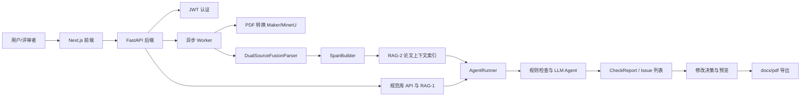

# 论文纠错智能 Agent 项目说明文档

## 一、项目背景与问题定义

本项目面向本科生、硕士研究生、博士研究生及科研论文作者，建设一个学术论文预检查与纠错 Agent。系统接收论文文件或解析后的论文文本，自动完成格式规范校验、文本纠错、逻辑一致性检查、参考文献合规检查与学术润色建议，并输出可追溯的结构化检查报告。

当前论文写作和预审流程中存在以下问题：

1. 论文格式规则分散，学校、期刊、学位类型之间差异大，人工核对容易遗漏。
2. 通用文本校对工具主要覆盖错别字和语病，难以识别章节结构、图表编号、参考文献标注、公式符号一致性等学术论文特有问题。
3. 论文修改过程缺少可复现的检查记录，难以追踪问题来源、规范依据和修改决策。
4. PDF、Markdown、Word 等输入格式差异较大，解析质量会影响后续检查结果。

项目目标是提供一套从论文解析、规范检索、Agent 检查、报告生成到修改决策与导出的完整闭环，降低论文初稿自查、导师初审和投稿前校对的重复性成本。

当前版本边界如下：

1. 当前 Demo 重点展示论文预检查与结构化报告，不承诺替代导师或评审专家的学术判断。
2. 复杂排版的最终 Word 样式还需要人工复核。
3. 未配置大模型 API Key 时，LLM 类检查会走规则或降级逻辑，效果低于完整 Agent 模式。
4. 真实 PDF 转换依赖 Maker/MinerU 兼容镜像，示例镜像主要用于本地接口联调。

## 二、Demo 功能范围

### 1. 输入形式

当前 Demo 支持以下输入：

1. Web 前端上传论文文件。
2. 后端 API 上传 Markdown 或 PDF 文件。
3. Maker 主文本与 MinerU 辅助解析结果双源输入。
4. 用户选择论文规范库，例如通用中文学术论文、复旦论文规范、复旦学位论文规范、华南理工大学学报自然科学版规范。

### 2. 输出形式

系统输出包括：

1. 任务状态和检测进度。
2. 论文解析质量信息。
3. 结构化 Issue 列表，包含问题类型、严重程度、原文片段、建议修改、证据和章节位置。
4. Markdown 检查报告。
5. 预览结果和用户修改决策。
6. docx/pdf 导出结果。

### 3. 核心功能

当前 Demo 已覆盖以下能力：

| 功能模块 | 当前能力 |
|---|---|
| 用户与任务 | JWT 注册登录、历史任务、任务状态查询 |
| 文件处理 | Markdown/PDF 上传，PDF 可通过 Maker/MinerU 兼容镜像转换 |
| 双源解析 | Maker 主文本与 MinerU 结构信息融合，输出统一 PaperDocument |
| 规范库 | 读取 `config/journals/*.yaml` 和 `config/rules/*.md`，支持规范列表、详情与规则检索 |
| RAG-1 | 将规范 YAML/Markdown 构建为规则切片索引，用于规则依据检索 |
| RAG-2 | 为当前论文构建 span 上下文索引，供纠错、逻辑和润色 Agent 使用 |
| 检查流程 | 格式、结构、参考文献、一致性等规则检查；Agent 模式支持 typo、grammar、logic、polish 等模块 |
| 进度反馈 | SSE 推送解析、格式检查、语法检查、润色、逻辑检查、参考文献检查、完成/失败等阶段 |
| 决策与导出 | 支持 Issue 决策、预览合成、docx/pdf 导出 |
| 前端界面 | Next.js 前端支持登录、上传、任务列表和报告查看 |

### 4. 功能边界

当前版本暂不重点覆盖：

1. 多人协同批注和导师端工作台。
2. 对所有学校、期刊规范的完整覆盖。
3. 对扫描版低质量 PDF 的高精度 OCR 兜底。
4. 完整的模型微调上线流程；LoRA/QLoRA 微调计划已经拆分，但 Demo 以规则、Prompt 和可选 LLM 调用为主。
5. 基于 Intel Core Ultra NPU 的专门本地推理优化。当前系统可采用本地解析、规则检查与可选云端 LLM 的混合架构，但未针对特定硬件做性能适配。

## 三、系统设计

### 1. 整体架构

### 2. 模块说明

| 模块 | 位置 | 职责 |
|---|---|---|
| 前端应用 | `apps/web-next` | 登录、上传论文、查看历史任务和报告详情 |
| 后端 API | `apps/api` | 认证、上传、任务、规范库、结果、进度、决策、导出接口 |
| Worker | `apps/worker` | 执行 PDF 转换、论文解析、索引构建和检查任务 |
| 数据模型 | `packages/schema` | PaperDocument、Span、Issue、CheckReport、JobRecord 等模型 |
| 解析器 | `packages/parser` | 双源融合解析与 span 构建 |
| 规则检查 | `packages/checks` | 结构、格式、参考文献、一致性检查 |
| Agent 模块 | `packages/agents` | 格式、结构、引用、错别字、语法、逻辑、润色等 Agent |
| 编排层 | `packages/orchestrator` | Agent 调度、Issue 合并、进度、预览、导出 |
| RAG 模块 | `packages/rag` | 规范规则切片检索和论文上下文检索 |
| 存储模块 | `packages/storage` | 用户、任务、报告和修改决策持久化 |
| 规范配置 | `config/journals`, `config/rules` | 高校/期刊规范和 GB/T 7714 规则材料 |

### 3. 执行流程

1. 用户通过前端登录并上传论文。
2. 后端创建任务，写入 JobRecord，并通过 Worker 异步执行。
3. Worker 对 PDF 执行转换，或直接读取 Markdown 输入。
4. DualSourceFusionParser 融合 Maker 和 MinerU 结果，生成统一 PaperDocument。
5. SpanBuilder 将论文切分为可定位的 span。
6. RAG-2 为当前任务构建上下文索引；RAG-1 在 API 启动时构建规范规则索引。
7. AgentRunner 根据 `AGENT_MODE=rules|agents|hybrid` 调度规则检查和 Agent 检查。
8. 系统合并去重 Issue，补全定位、证据和建议，生成 CheckReport。
9. 前端通过任务接口和 SSE 展示进度，通过结果接口展示报告。
10. 用户可对 Issue 做接受、拒绝或自定义修改决策，并导出 docx/pdf。

### 4. 评估指标

| 指标 | 观察方式 |
|---|---|
| 任务完成情况 | 上传样例论文后，任务能完成并生成报告 |
| 工具调用正确性 | 检查解析、span 构建、RAG 索引、规则检查、Agent 检查、导出是否按流程执行 |
| 结果质量 | Issue 是否包含问题类型、证据、建议和可定位片段 |
| 运行稳定性 | API、Worker、前端、SSE 过程中是否出现中断或未处理异常 |
| 过程可检查性 | 是否能查看任务状态、进度阶段、解析质量、报告 Markdown 和导出文件 |
| 可复现性 | 按 README 安装依赖和启动命令后，评审者能复现 Demo |

当前本地测试样例使用 `samples/` 中的 Maker/MinerU Markdown 文件和 `samples/mse/theses/tier-a-primary.pdf` PDF 样例。`local_test_report.md` 中记录了一次样例论文检查结果：解析融合得分为 0.7，发现 1 个错误、120 个警告、7 个提示；其中包含 DOI 格式、OCR 数值空格、格式规范等问题。

## 四、当前开发中出现的问题与处理

| 问题或风险 | 当前处理 | 后续计划 |
|---|---|---|
| 模型输出不稳定 | Agent 输出使用结构化 Issue 模型，并通过 Pydantic 校验和后处理过滤 | 继续完善 JSON Schema、Prompt 模板和微调数据集 |
| LLM 依赖外部 API Key | 未配置 API Key 时保留规则检查和降级逻辑 | 接入 ModelRouter，支持不同模型和本地/云端切换 |
| PDF 解析质量差异 | 使用 Maker 主文本和 MinerU 辅助结构双源融合，记录 parse_quality | 引入更多真实样本，优化表格、公式、图注解析 |
| 规范库覆盖有限 | 当前已有通用、复旦、复旦学位论文、华南理工学报和 GB/T 7714 规则材料 | 扩展更多学校/期刊规范，补充规则回归测试集 |
| Demo 可复现性 | README、Docker Compose、部署说明和测试命令已整理 | 提交前再次验证启动命令和依赖安装流程 |
| 数据隐私和安全 | `.env`、数据库、上传文件、Token 不纳入 Git 提交 | 提交材料中使用占位符说明环境变量，避免泄露密钥 |

## 五、后续计划

| 时间阶段 | 计划任务 |
|---|---|
| 中期后第 1 周 | 完善 Demo 视频、补齐样例数据说明，验证评审者从空环境启动流程 |
| 中期后第 2 周 | 扩展规范库和 RAG-1 规则切片，增加更多期刊/高校规则 |
| 中期后第 3 周 | 强化 Agent-2/3/4 的 Prompt、后验校验和异常降级 |
| 中期后第 4 周 | 构建微调数据集，尝试 Qwen/GLM 系列 LoRA 或 QLoRA 微调 |
| 结题前 | 完成端到端 Demo、测试报告、用户手册和最终答辩材料 |

## 六、项目组成员情况

| 姓名 | 角色 | 职责 | 年级/专业 |
|---|---|---|---|
| 管慧君 | 项目经理兼产品经理 | 统筹进度、定义交付标准、制定测试集、组织效果评测和资源协调 | 待补充 |
| 王诗琪 | 数据清洗与知识库工程师 | 使用 MinerU/Marker/Pandoc 等工具清洗规范文档，整理 Markdown 和 RAG 知识库材料 | 待补充 |
| 尚国瑞 | 数据清洗与知识库工程师 | 规范材料清洗、分层切片、元数据标注和向量库/索引导入 | 待补充 |
| 赵思远 | 算法与微调工程师 | 构建微调数据集，进行 LoRA/QLoRA 微调和 Prompt 调优 | 待补充 |
| 徐阳 | 算法与微调工程师 | 模型调用、Agent 流水线、结构化输出和后处理优化 | 待补充 |
| 黄婧雯 | 前端开发及 UI 设计工程师 | 论文上传、规范选择、报告查看、纠错对比等前端界面开发 | 待补充 |
