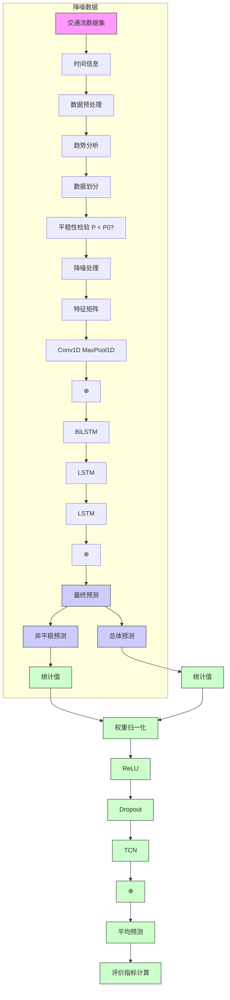
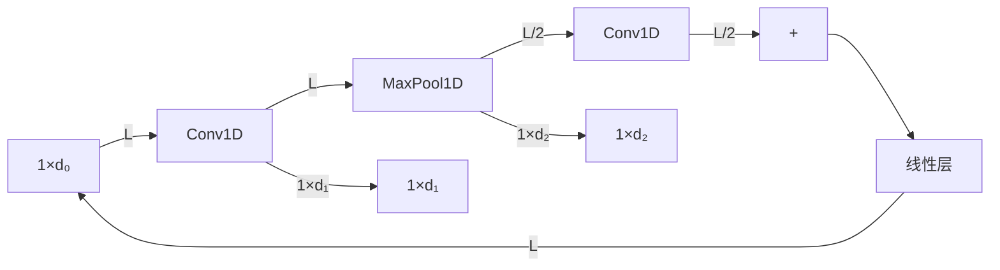
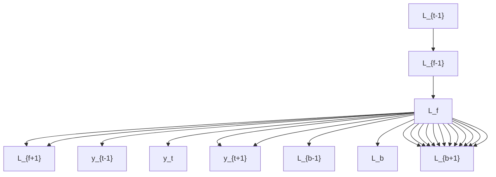
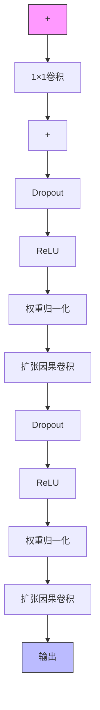

text_image

华南理工大学
自然科学版
National Science Edition

华南理工大学学报(自然科学版)

Journal of South China University of Technology(Natural Science Edition)

ISSN 1000-565X,CN 44-1251/T

# 《华南理工大学学报(自然科学版)》网络首发论文

题目： 基于集成深度学习模型的公路隧道交通流预测

作者： 钱超，李俊，李发强，赵一辰，周钟文，刘怡策，程剑英

收稿日期： 2025-08-08

网络首发日期： 2026-05-22

引用格式： 钱超，李俊，李发强，赵一辰，周钟文，刘怡策，程剑英．基于集成深度学习模型的公路隧道交通流预测[J/OL]．华南理工大学学报(自然科学版).

https://link.cnki.net/urlid/44.1251.t.20260521.1658.006

nki中国知網

www.cnki.net

网络首发：在编辑部工作流程中，稿件从录用到出版要经历录用定稿、排版定稿、整期汇编定稿等阶段。录用定稿指内容已经确定，且通过同行评议、主编终审同意刊用的稿件。排版定稿指录用定稿按照期刊特定版式（包括网络呈现版式）排版后的稿件，可暂不确定出版年、卷、期和页码。整期汇编定稿指出版年、卷、期、页码均已确定的印刷或数字出版的整期汇编稿件。录用定稿网络首发稿件内容必须符合《出版管理条例》和《期刊出版管理规定》的有关规定；学术研究成果具有创新性、科学性和先进性，符合编辑部对刊文的录用要求，不存在学术不端行为及其他侵权行为；稿件内容应基本符合国家有关书刊编辑、出版的技术标准，正确使用和统一规范语言文字、符号、数字、外文字母、法定计量单位及地图标注等。为确保录用定稿网络首发的严肃性，录用定稿一经发布，不得修改论文题目、作者、机构名称和学术内容，只可基于编辑规范进行少量文字的修改。

出版确认：纸质期刊编辑部通过与《中国学术期刊（光盘版）》电子杂志社有限公司签约，在《中国学术期刊（网络版）》出版传播平台上创办与纸质期刊内容一致的网络版，以单篇或整期出版形式，在印刷出版之前刊发论文的录用定稿、排版定稿、整期汇编定稿。因为《中国学术期刊（网络版）》是国家新闻出版广电总局批准的网络连续型出版物（ISSN 2096-4188，CN 11-6037/Z），所以签约期刊的网络版上网络首发论文视为正式出版。

# 基于集成深度学习模型的公路隧道交通流预测

钱超1 李俊1 李发强2 赵一辰1 周钟文2 刘怡策1 程剑英2

（ 长安大学 电子与控制工程学院，陕西 西安 ； 海南交控科技有限公司，海南 海口 ）

摘 要：公路隧道交通流预测是合理优化隧道运营管控方案的重要技术基础。针对交通流数据的非线性、时空耦合性以及降噪处理中扰动信息丢失等问题，提出了一种结合趋势建模与残差补偿的公路隧道交通流预测模型。首先，基于对交通流数据的趋势与统计特征分析，将原始数据划分为客车与货车两类；其次，结合平稳性检验结果，对非平稳数据采用高斯平滑方法进行降噪处理；然后，将平稳数据与降噪数据输入融合卷积神经网络、双向长短期记忆网络和时序自注意力机制的主干网络，以提取趋势特征，并引入时序卷积网络对残差数据进行建模，以恢复降噪处理中丢失具有时序结构的扰动特征；最后，通过融合趋势特征与扰动特征，生成最终预测结果。选取秦岭终南山公路隧道的小时流量数据进行模型训练和测试，实验结果表明：在对总体流量的连续预测中，集成深度学习模型预测的均方根误差为 ，加权平均绝对百 分 比 误差 为 4. 18%±1. 06%，与 其他 预 测 模型 的 最 优 结 果（64. 28±7. 84 pcu、6. 57%± ）相比，两类误差分别降低了 、 。在消融实验中，残差补偿模块对模型性能影响最显著，可使两类误差分别降低 、 。研究结果为公路隧道智能交通系统的动态流量预测提供了理论基础。

关键词：智能交通；交通流预测；深度学习；公路隧道；残差建模

中图分类号：

随着交通出行需求和汽车保有量的持续增长，公路交通面临的拥堵与事故问题日益严峻［1］ 。隧道作为公路网络的重要组成部分，由于结构封闭，一旦发生交通拥堵或事故，不仅会显著降低通行效率，还会带来更高的事故风险［2］ 。相比开阔道路，隧道交通流受空间与视距限制，行驶速度与换道条件受限，流量数据呈现出更强的非线性与时空耦合性。短时流量变化不仅反映交通运行状态，也直接影响通风需求与运营安全［3］ 。因此，针对隧道场景开展高精度交通流预测研究，不仅能为通风控制与运行调度提供科学依据，也有助于加快智能隧道建设。

目前，交通流预测模型可分为参数模型和非参数模型［4］ 。参数模型基于数理统计方法构建，如差分自回归移动平均模型［5］（ ）和卡尔曼滤波器［6］ 等，但由于对平稳性假设的依赖，使其在面对复杂多变的交通时存在一定局限性。而非参数模型则基于数据驱动方法构建，能更好适应交通流数据的非线性特征，主要包括机器学习模型和深度学习模型。常见的机器学习模型有支持向量机回归（ ）、随机森林（ ）和 近邻（ ）。 等［7］通过 对交通流进行初步预测，引入 对预测误差进行建模修正，从而提高短时交通流预测精度。田佳等［8］ 将交通流数据分解为多尺度分量，并分别输入RF进行建模，以增强模型对局部扰动的表征能力。这些方法在一定程度上提升了机器学习模型的预测精度，但在建模复杂特征关系方面，其表达能力仍然有限，且依赖于人工设计特征。随着深度学习模型在特征提取与时序关系建模方面展现出优势，其在交通流预测领域被广泛应用。段中兴等［9］采用滑动平均方法对隧道交通流数据进行降噪处理，以降低数据的复杂性，从而提升长短期记忆网络（LSTM）的预测精度。Bharti等［10］则基于交通流同时受历史与未来状态影响的特点，构建双向长短期记忆网络（BiLSTM），以更充分地捕捉交通流数据的双向时序依赖关系。等［11］ 提出使用卷积神经网络（ ）优化 ，通过卷积操作与维度压缩，在提取局部时序特征时增强对短期模式变化的感知能力。李桃迎等［12］则提出一种面向高速公路的集成深度学习模型，利用CNN提取上下游交通流的空间关联特征，并结合 LSTM 与门控循环单元（Gated Recurrent Unit，）捕捉交通流的时间长短期依赖，研究结果验证了多模块融合的集成策略在交通流预测任务中的有效性。为突出对重要信息的关注，部分学者开始尝试引入注意力机制（Attention Mechanism，AM）。戢晓峰等［13］ 通过在BiLSTM中嵌入AM，动态评估各时刻特征的重要程度，强化隐藏层对节假日交通流非线性、突变性特征的捕捉能力。等［14］ 则提出了一种融合注意力机制与时序卷积网络（ ， ）的混合模型，利用注意力机制来挖掘交通流数据的长期依赖，同时通过并行 结构建模短期波动，从而提升在长短期尺度上的预测性能。对于公路隧道场景，现有研究主要关注交通流的时空特征，王九胜等［2］ 通过提取并融合不同时间尺度下的粒度特征，增强模型对多变交通环境的适应性。Zeng等［15］ 则考虑构建全面的公共假期出行数据库并结合上下游流量变化，以提高模型对关键时段的预测精度。

尽管深度学习模型在交通流预测中具有良好的性能，现有研究仍存在以下不足：一是特征耦合不足，缺乏对目标场景下交通运行模式、车辆类型以及休息日与工作日等特征的综合考虑；二是残余信息利用不足，未充分挖掘降噪过程丢失的扰动特征，限制了整体预测精度的进一步提升。

针对上述不足，本文提出一种面向公路隧道交通流的集成深度学习模型（Integrated Deep LearningModel， IDLM）。模型创新主要体现在以下三方面：

（）设计由主干网络与残差补偿模块组成的双分支结构，对交通流全局趋势与局部扰动并行建模；  
（）通过融合非平稳数据的趋势与扰动特征，补偿降噪处理产生的信息丢失，进一步提高模型预测的精确性；  
（）针对隧道交通流的车型差异与时段规律，结合统计特征分析对数据进行分层建模与特征增强，提升模型在复杂交通场景下的泛化能力。

# 问题描述

交通流预测旨在利用交通历史监测数据预测未来一段时间内的交通流变化，其预测精度常受原始数据的质量、完整性以及交通流结构动态变化等多种不确定因素的影响。

设给定交通流数据集X，预测问题的一般处理步骤如下：

步骤（）：通过插补函数进行缺失值填充和异常值处理，得到预处理后的流量数据 $X _ { 0 } ,$ 。

$$
\boldsymbol {X} _ {0} = F _ {\text { line }} (\boldsymbol {X}) + F _ {\text { normal }} (\boldsymbol {X}) \tag {1}
$$

步骤（）：利用 平稳性检验将 $X _ { 0 }$ 划分为平稳流量数据Xˉ和非平稳流量数据X͂。

$$
A D F = \frac {\hat {\gamma}}{S E (\hat {\gamma})} \tag {2}
$$

$$
p = \operatorname * {P r} \left(A D F \leqslant A D F _ {o b s} \mid H _ {0}\right) \tag {3}
$$

$$
\boldsymbol {X} _ {0} \stackrel {A D F \text {检验}} {\longrightarrow} \left\{ \begin{array}{l l} \bar {\boldsymbol {X}} & , p <   p _ {0} \\ \tilde {\boldsymbol {X}} & , p > p _ {0} \end{array} \right. \tag {4}
$$

步骤（）：对 $\tilde { X }$ 进行降噪处理获得降噪数据 ${ \tilde { X } } ^ { \prime }$ 和残差数据 $\tilde { X } ^ { \prime \prime }$ 。

$$
\tilde {X} ^ {\prime} = G (\tilde {X}) \tag {5}
$$

$$
\tilde {X} ^ {\prime \prime} = \tilde {X} - \tilde {X} ^ {\prime} \tag {6}
$$

步骤（4）：模型提取交通流的时空特征，预测未来M个时刻的流量数据。

$$
X (T + 1), \dots , X (T + M) = F _ {X} \left(\bar {X}, \tilde {X} ^ {\prime}, \tilde {X} ^ {\prime \prime}\right) \tag {7}
$$

式（1）（- 7）中： $F _ { l i n e }$ 、 $F _ { n o r m a l }$ 分别为缺失值插补函数、异常值插补函数；γ为待检验值，γ̂ 为估计值；ADF为检验统计量， $A D F _ { o b s }$ 为由样本计算的统计值；$p$ 为检验统计量对应的概率值， $p _ { 0 }$ 为平稳性判断阈值（边界值）；SE( )为标准误差，Pr( )为事件发生概率； $H _ { 0 }$ 为原假设（序列非平稳）；G为降噪函数； $F _ { \chi }$ 为时空特征的映射函数。

# 集成深度学习模型构建

考虑交通流的动态变化特性、复杂性及不同类型车辆出行行为的差异性，提出一种基于IDLM的交通流预测方法，总体研究框架如图1所示。首先，结合对原始数据的趋势及统计特征分析结果，进行数据划分，并对预处理后的分类数据开展平稳性检验；然后，构建 CNN-BiLSTM-TSA 主干网络，用于提取平稳数据Xˉ和降噪数据X͂′的交通流趋势特征，并引入基于 的残差补偿模块，对残差数据X͂″进行建模。最后，融合趋势特征与扰动特征，从而实现对交通流的精准预测。

flowchart

图 总体研究框架图  
Fig. 1 Framework diagram of overall research

# 数据预处理

为提高交通流数据集的质量，对缺失值和异常值根据文献［ ］所提方法建立回归模型进行迭代插补和替换，以维持数据趋势的连续性和周期性。对非平稳数据采用高斯平滑（Gaussian Smoothing，）方法进行降噪处理，以降低噪声干扰、平滑局部波动。高斯核函数的标准差参数为 ，数学表达式如下：

$$
G _ {t} = \sum_ {n = - r} ^ {r} x _ {t + n} \cdot g _ {n} \tag {8}
$$

式中： $G _ { t }$ 为第t时刻平滑处理后的流量数据； $x _ { t }$ 为第t时刻的交通流量； $g _ { n }$ 为高斯权重函数；r为窗口半径。

为保留交通流与时间信息的关联性，构建包含小时信息的特征矩阵，并结合预测需求加入辅助特征（如工作日与休息日），以提升模型对不同时间场景的识别与适应能力。特征矩阵结构如下：

$$
\left[ \begin{array}{c c c c} x _ {t} & h _ {t} ^ {(\sin)} & h _ {t} ^ {(\cos)} & D _ {t} \\ x _ {t + 1} & h _ {t + 1} ^ {(\sin)} & h _ {t + 1} ^ {(\cos)} & D _ {t + 1} \\ \vdots & \vdots & \vdots & \vdots \\ x _ {T} & h _ {T} ^ {(\sin)} & h _ {T} ^ {(\cos)} & D _ {T} \end{array} \right] \tag {9}
$$

式中： $h _ { t } ^ { ( \mathrm { s i n } ) }$ 和 $h _ { t } ^ { ( \mathrm { c o s } ) }$ 为时间t的正余弦编码； $D _ { t }$ 为辅助标签，取1为工作日，取0为休息日。

# 卷积神经网络

可扩展为一维卷积结构，用于在时间轴上捕捉数据局部变化模式。其结构如图2所示，卷积层和池化层计算公式如下：

$$
x _ {t} ^ {(c o n v)} = \sum_ {n = 0} ^ {k - 1} w _ {n} \cdot x _ {t + n} + b _ {c o n v} \tag {10}
$$

$$
x _ {t} ^ {(p o o l)} = \max \left(x _ {t \cdot S} ^ {(c o n v)}, x _ {t \cdot S + 1} ^ {(c o n v)}, \dots , x _ {t \cdot S + K - 1} ^ {(c o n v)}\right) \tag {11}
$$

flowchart

图2 CNN结构图  
Fig. 2 Structure of CNN

式中： $\boldsymbol x _ { t } ^ { ( c o n v ) }$ 为位置t处的卷积结果；k为卷积核大小；w为卷积核权重； $b _ { c o n v }$ 为偏置项； $x _ { t } ^ { ( p o o l ) }$ 为位置t处的池化结果；S为步长；K为池化核大小。

# 双向长短期记忆网络

通过引入门控机制有效缓解处理长序列时的信息遗失问题。 结构如图 （）所示，相

```mermaid
graph TD
    A["C_{t-1}"] --> B["×"]
    C["h_{t-1}"] --> D["σ"]
    E["x_t"] --> F["σ"]
    B --> G["×"]
    H["σ"] --> I["tanh"]
    I --> J["×"]
    K["σ"] --> L["tanh"]
    L --> M["×"]
    N["×"] --> O["tanh"]
    O --> P["×"]
    Q["σ"] --> R["tanh"]
    R --> S["×"]
    T["h_t"] --> U["×"]
    V["C_t"] --> W["×"]
    X["h_t"] --> Y["×"]
    Z["h_t"] --> AA["×"]
    AB["h_t"] --> AC["×"]
    AD["h_t"] --> AE["×"]
    AF["h_t"] --> AG["×"]
    AH["h_t"] --> AI["×"]
    AJ["h_t"] --> AK["×"]
    AL["h_t"] --> AM["×"]
    AN["h_t"] --> AO["×"]
    AP["h_t"] --> AQ["×"]
    AR["h_t"] --> AS["×"]
    AT["h_t"] --> AU["×"]
    AV["h_t"] --> AW["×"]
    AX["h_t"] --> AY["×"]
    AZ["h_t"] --> BA["×"]
    BB["h_t"] --> BC["×"]
    BD["h_t"] --> BE["×"]
    BF["h_t"] --> BG["×"]
    BH["h_t"] --> BI["×"]
    BJ["h_t"] --> BK["×"]
    BL["h_t"] --> BM["×"]
    BN["h_t"] --> BO["×"]
    BP["h_t"] --> BQ["×"]
    BR["h_t"] --> BS["×"]
    BT["h_t"] --> BU["×"]
    BV["h_t"] --> BW["×"]
    BX["h_t"] --> BY["×"]
    BZ["h_t"] --> BQ
    CA["h_t"] --> BQ
    CB["h_t"] --> BQ
    CC["h_t"] --> BQ
    DD["h_t"] --> BQ
    EY["h_t"] --> Z
    Z --> AB
    Z --> AC
    Z --> AD
    Z --> AE
    Z --> AF
    Z --> BB
    Z --> BC
    Z --> BT
    Z --> AB
    Z --> AC
    Z --> AD
    Z --> AE
    Z --> AF
    Z --> BB
    Z --> BC
    Z --> BT
    Z --> AB
    Z --> AC
    Z --> AD
    Z --> AE
    Z --> AF
    Z --> BB
    Z --> BC
    Z --> BT
    Z --> AB
    Z --> AC
    Z --> AD
    Z --> AF
    Z --> BB
    Z --> BC
    Z --> AD
    Z --> AE
    Z --> AF
    Z --> BB
    Z --> BC
    Z --> AD
    Z --> AE
    Z --> AF
    Z --> BB
    Z --> BC
    Z --> AD
    Z --> AE
    Z --> AF
    Z --> BB
    Z --> BC
    Z --> AD
    Z --> AE
    Z --> AF
    Z --> BB
    Z --> BC
    Z --> AD
    Z --> AF
    Z --> BC
    Z --> AD
    Z --> AE
    Z --> AF
    Z --> BB
    Z --> BC
    Z --> AD
    Z --> AE
    Z --> AF
    Z --> BB
    Z --> BC
    Z --> AD
    Z --> AE
    Z --> AF
    Z --> BB
    Z --> BC
    Z --> AD
    Z --> AE
    Z --> AF
    Z --> BC
    Z --> BC
    Z --> AD
    Z --> AE
    Z --> AF
    Z --> BC
    Z --> BC
    Z --> AD
    Z --> AE
    Z --> AF
    Z --> BC
    Z --> BC
    Z --> AD
    Z --> AE
    Z --> AF
    Z --> BC
    Z --> BC
    Z --> AD
    Z --> AE
    Z --> AF
    Z --> AC
    Z --> BC
    Z --> AD
    Z --> AE
    Z --> AF
    Z --> BC
    Z --> BC
    Z --> AD
    Z --> AE
    Z --> AF
    Z --> BC
    Z --> BC
    Z --> AD
    Z --> AE
    Z --> AF
    Z --> BC
    Z --> BC
    Z --> AD
    Z --> AE
    Z --> AF
    Z --> BQ
    Z --> BC
    Z --> BC
    Z --> BC
    Z --> BC
    Z --> BC
    Z --> BC
    Z --> BC
    Z --> BC
    Z --> BC
    Z --> BC
    Z --> BC
    Z --> BC
    Z --> BC
    Z --> BC
    Z --> BC
    Z --> BC
    Z --> BC
    Z --> BC
    Z --> BC
    Z --> BC
    Z --> BQ
    Z --> BC
    Z --> BC
    Z --> BC
    Z --> BC
    Z --> BC
    Z --> BC
    Z --> BC
    Z --> BC
    Z --> BC
    Z --> BC
    Z --> BC
    Z --> BC
    Z --> BC
    Z --> BC
    Z --> BC
    Z --> BC
    Z --> BC
    Z --> BC
    Z
    BC
    BC
    BC
    BC
    BC
    BC
    BC
    BC
    BC
    BC
    BC
    BC
    BC
    BC
    BC
    BC
    BC
    BC
    BC
    BC
    BC
    BC
    BC
    BC
    BC
    BC
    BC
    BC
    BC
    BC
    BC
    BC
    BC
    BC
```

flowchart

（a） LSTM

flowchart

（b） BiLSTM  
图3 网络结构  
Fig. 3 Structure of network

关计算公式如下：

$$
f _ {t} = \sigma \left(W _ {f} x _ {t} + U _ {f} h _ {t - 1} + b _ {f}\right) \tag {12}
$$

$$
i _ {t} = \sigma \left(W _ {i} x _ {t} + U _ {i} h _ {t - 1} + b _ {i}\right) \tag {13}
$$

$$
\tilde {C} _ {t} = \tanh \left(W _ {C} x _ {t} + U _ {C} h _ {t - 1} + b _ {C}\right) \tag {14}
$$

$$
C _ {t} = f _ {t} \cdot C _ {t - 1} + i _ {t} \cdot \tilde {C} _ {t} \tag {15}
$$

$$
o _ {t} = \sigma \left(W _ {o} x _ {t} + U _ {o} h _ {t - 1} + b _ {o}\right) \tag {16}
$$

$$
h _ {t} = o _ {t} \cdot \tanh \left(C _ {t}\right) \tag {17}
$$

式中： $f ,$ ，i，o分别为遗忘门、输入门和输出门；W，U为权重参数；b为偏置项； $h _ { t }$ 为t时刻的记忆细胞； $\tilde { C } _ { t }$ 为候选记忆单元； $C _ { t }$ 为记忆单 $\widehat { \mathcal { T } \mathrm { L } }$ ；σ和tanh分别为Sigmoid激活函数和双曲正切激活函数。

考虑实际交通流演化具有连续性、时滞性等特征，当前时刻的交通流状态不仅依赖于过去，还可能受未来时刻的影响。为充分建模序列中前后时刻的信息关联，选择 构建主干网络。由两个 单元组成，分别沿时间的正序和逆序传递信息，将各自隐藏状态拼接后作为输出，其结构如图 （）所示。

# 时序自注意力机制

和 模块能够有效提取局部时序特征和捕捉双向依赖关系，但在建模全局时序关联性方面，特别是在跨时间步的重要信息识别上存在一定局限性。为此，引入时序自注意力机制，通过分配不同时间步的注意力权重，引导模型聚焦于关键时间信息，从而提升整体预测性能。TSA模块的数据处理步骤如下：

（1）对BiLSTM的输出序列 $X _ { _ { B i } }$ 进行线性变换：

$$
\boldsymbol {Q} = \boldsymbol {X} _ {B i} \boldsymbol {W} _ {Q}, \quad \boldsymbol {K} = \boldsymbol {X} _ {B i} \boldsymbol {W} _ {K}, \quad \boldsymbol {V} = \boldsymbol {X} _ {B i} \boldsymbol {W} _ {V} \tag {18}
$$

（2）通过点积注意力机制计算各时间步之间的相关性得分，并进行归一化处理：

$$
\boldsymbol {A} = \text { Softmax } \left(\frac {\boldsymbol {Q} \cdot \boldsymbol {K} ^ {T}}{\sqrt {d}}\right) \tag {19}
$$

（）通过残差连接与层归一化进行特征输出：

$$
\boldsymbol {Y} = \text { LayerNorm } \left(\boldsymbol {X} _ {B i} + \boldsymbol {A} \cdot \boldsymbol {V}\right) \tag {20}
$$

式（ ）-（ ）中：Q、K、V分别为查询、键和值矩阵；W为权重矩阵；A为注意力权重矩阵；d为每个时间步的特征维度；Y为加权特征矩阵。

# 时序卷积网络

作为一种针对时间序列数据的深度学习网络，通过结合因果卷积与扩张卷积，能够在保留数据前后因果关系的前提下，扩展卷积核的范围，有效捕捉长期时间依赖关系，其结构如图 所示。为降低 对噪声数据的敏感性，引入软阈值机制。机制基于输入数据的统计特征设定动态阈值，将小于阈值的特征值置为0，从而削弱无效信息的干扰，其数学公式如下：

$$
\hat {x} = \left\{ \begin{array}{c c} x - \lambda , & x > \lambda \\ 0, & | x | \leqslant \lambda \\ x + \lambda , & x <   - \lambda \end{array} \right. \tag {21}
$$

式中：x̂ 为软阈值化后的特征值；x为输入特征值；λ为动态阈值。

flowchart

图4 TCN结构图  
Fig. 4 Structure of TCN

# 实验分析

# 3. 1 数据集与特征分析

秦岭终南山公路隧道北起西安市青岔村、南至商洛市柞水县，是国高网包头至茂名高速公路（G65）的控制性工程。实验使用的交通流数据集源自隧道内车辆检测器的检测记录。记录内容涵盖了检测起止时间、断面方向、车型、交通流量等多个字段。数据集的时间跨度为2023年7月1日至8月日，采样汇总间隔为 $1 \mathrm { { h } } _ { \circ }$ 该时段交通流量与气候条件相对稳定，且未发生重大交通管制事件，能够避免极端天气或外部事件对交通流规律的干扰。此外，为更好地研究流量周期性规律，对不具有完整周结构的时段（ 月 日至 日、 月 日至日）进行剔除。而 月 日至 日因原始数据缺失严重也进行剔除处理。因此，实验筛选西线（西安至安康方向） 月 日至 月 日 周完整的数据作为基础，总计1176个时间节点。结合《公路工程技术标准》（ — ）对六类车型流量进行标准车流量折算，车辆折算系数见表1。

鉴于不同类型车辆在运行特性、交通行为上存在差异，实验将折算后的数据集分为客车和货车两类。数据集前 周交通流变化趋势如图 所示。其中， 月 日 ： - ： 、 月 日 ： - ：和 月 日 ： - ： 及 ： - ： 等时段存在数据缺失，而 月 日 ： - ： 、 月 日： - ： 、 月 日 ： - ： 、 月 日： - ： 和 月 日 ： - ： 等时段存在数据异常，这可能是由检测设备故障、数据传输异常或隧道运营临时管控等因素引起。除去缺失值和异常值的影响，工作日交通流表现出明显的周期性特征，而休息日（特别是星期六）交通流则呈现出异质性的演化趋势（即在相同的时间节点上，交通流量的变化存在显著差异，呈现较强的非规律性与不确定性）。

表1 标准车折算系数  
Table 1 Passenger car equivalency factors 

<table><tr><td>数据集划分</td><td>车型</td><td>折算系数</td><td>说明</td></tr><tr><td rowspan="2">客车流量</td><td>中小客车</td><td>1.0</td><td>座位 $\leqslant$ 19座</td></tr><tr><td>大型客车</td><td>1.5</td><td>座位 $>$ 19座</td></tr><tr><td rowspan="4">货车流量</td><td>小型货车</td><td>1.0</td><td>载质量 $\leqslant$ 2t</td></tr><tr><td>中型货车</td><td>1.5</td><td>2 t&lt;载质量 $\leqslant$ 7 t</td></tr><tr><td>大型货车</td><td>3.0</td><td>7 t&lt;载质量 $\leqslant$ 20 t</td></tr><tr><td>特大型货车</td><td>4.0</td><td>载质量 $>$ 20 t</td></tr></table>

area

| 时间/h | 客车 (10² pcu) | 货车 (10² pcu) |
|---|---|---|
| 0 7/3 | 3 | 2 |
| 12 0 7/3 | 8 | 4 |
| 0 7/4 | 10 | 5 |
| 12 0 7/4 | 12 | 6 |
| 0 7/5 | 10 | 5 |
| 12 0 7/5 | 12 | 6 |
| 0 7/6 | 10 | 5 |
| 12 0 7/6 | 12 | 6 |
| 0 7/7 | 10 | 5 |
| 12 0 7/7 | 12 | 6 |
| 0 7/8 | 15 | 5 |
| 12 0 7/8 | 10 | 4 |
| 0 7/9 | 12 | 5 |
| 12 0 7/9 | 10 | 4 |

（） 第 周

area

| 时间/h | 客车 (10²) | 货车 (10²) |
| ------ | ---------- | ---------- |
| 0      | 6          | 3          |
| 12     | 12         | 4          |
| 0      | 10         | 5          |
| 12     | 13         | 6          |
| 0      | 11         | 5          |
| 12     | 14         | 7          |
| 0      | 12         | 6          |
| 12     | 15         | 8          |
| 0      | 13         | 7          |
| 12     | 16         | 9          |
| 0      | 14         | 8          |
| 12     | 17         | 10         |
| 0      | 15         | 9          |
| 12     | 18         | 11         |
| 0      | 16         | 10         |
| 12     | 19         | 12         |
| 0      | 17         | 11         |
| 12     | 20         | 13         |

（b） 第 2 周

area

| 时间/h | 客车 (10²) | 货车 (10²) |
|---|---|---|
| 0 7/17 | 12 | 4 |
| 12 7/17 | 13 | 5 |
| 0 7/18 | 14 | 5 |
| 12 7/18 | 13 | 5 |
| 0 7/19 | 12 | 5 |
| 12 7/19 | 13 | 5 |
| 0 7/20 | 14 | 5 |
| 12 7/20 | 15 | 5 |
| 0 7/21 | 13 | 5 |
| 12 7/21 | 14 | 5 |
| 0 7/22 | 18 | 5 |
| 12 7/22 | 19 | 5 |
| 0 7/23 | 14 | 5 |
| 12 7/23 | 13 | 5 |

（c） 第 3 周

area

| 时间/h | 客车 (10² pcu) | 货车 (10² pcu) |
|---|---|---|
| 0 7/24 | 5 | 3 |
| 12 0 7/24 | 14 | 5 |
| 0 7/25 | 13 | 4 |
| 12 0 7/25 | 13 | 5 |
| 0 7/26 | 13 | 5 |
| 12 0 7/26 | 13 | 5 |
| 0 7/27 | 13 | 5 |
| 12 0 7/27 | 13 | 5 |
| 0 7/28 | 13 | 5 |
| 12 0 7/28 | 13 | 5 |
| 0 7/29 | 13 | 5 |
| 12 0 7/29 | 13 | 5 |
| 0 7/30 | 13 | 5 |
| 12 0 7/30 | 13 | 5 |

（d） 第4周

area

| 时间/h | 客车 (10^2) | 货车 (10^2) |
|---|---|---|
| 0 7/31 | 4 | 2 |
| 12 0 | 12 | 4 |
| 12 8/1 | 10 | 3 |
| 0 8/2 | 15 | 4 |
| 12 0 | 14 | 5 |
| 12 8/3 | 13 | 4 |
| 0 8/4 | 12 | 3 |
| 12 0 | 13 | 4 |
| 12 8/5 | 18 | 5 |
| 0 8/6 | 11 | 3 |
| 12 8/6 | 10 | 3 |

（） 第 周

area_stacked

| 时间/h | 客车 (10²) | 货车 (10²) |
|---|---|---|
| 0 8/7 | 4 | 2 |
| 12 0 | 16 | 3 |
| 0 8/8 | 12 | 4 |
| 12 0 | 14 | 5 |
| 0 8/9 | 14 | 5 |
| 12 0 | 15 | 5 |
| 0 8/10 | 14 | 5 |
| 12 0 | 13 | 5 |
| 0 8/11 | 13 | 5 |
| 12 0 | 14 | 5 |
| 0 8/12 | 17 | 4 |
| 12 0 | 12 | 3 |
| 0 8/13 | 12 | 3 |

（） 第 周  
图 分车型交通流变化趋势  
Fig. 5 Tendency of variation in traffic flow for different vehicle categories

图 为一周内不同时段的平均小时流量变化趋势。在工作日，客车与货车流量均呈现出一定的日周期特征，且两者流量占比均衡；而在休息日，两者的变化趋势则相对分化，具体表现为：客车流量显著上升，成为主要交通构成部分，而货车流量则小幅下降，通行需求有所减少。

为进一步验证划分和样本量的合理性，从统计特征角度对两类数据进行对比分析，包括基本统计量（均值、标准差、变异系数）、分布特征（偏度、峰度）、平稳性检验（ 检验）以及基于等效独立样本量的功效分析等，具体结果见表 。从基本统计量来看，两类数据的均值水平接近，但客车流量的标准差与变异系数明显高于货车流量，表明客车交通流波动性更强，受时段或其他外部因素的影响更为显著。从分布特征来看，客车流量的偏度为0. 59，峰度为0. 12，分布轻微右偏且具有尖峰，存在流量陡增现象；而货车流量的偏度为 ，峰度为- ，分布近似对称且偏平，极端流量值较少。从平稳性检验的结果来看，客车流量序列平稳，更具规律性与周期性；而货车流量序列非平稳，可能存在趋势性成分，需要进一步数据处理。综上所述，两类数据在统计特征上存在显著差异，将其作为独立子类进行建模与分析是合理的。而从功效分析 来 看 ， 两 类 数 据 对 中 等 效 应 量（Cohen’ s d =）的检验功效分别达到 和 ，可以认为当前样本量足以支持对中等及以上效应的检验。

line

| 时间节点/h | 客车 | 货车 |
| ---------- | ---- | ---- |
| 0          | 0    | 200  |
| 12         | 700  | 500  |
| 24         | 200  | 500  |
| 36         | 700  | 500  |
| 48         | 200  | 500  |
| 60         | 700  | 600  |
| 72         | 200  | 500  |
| 84         | 700  | 600  |
| 96         | 200  | 500  |
| 108        | 700  | 600  |
| 120        | 200  | 500  |
| 132        | 1200 | 400  |
| 144        | 200  | 300  |
| 160        | 800  | 400  |

图 不同车型平均交通流量  
Fig. 6 The average traffic volume for different vehicle categories

表 统计特征对比  
Table 2Statistical feature comparison 

<table><tr><td>类别</td><td>客车</td><td>货车</td></tr><tr><td>均值</td><td>389.14</td><td>408.52</td></tr><tr><td>标准差</td><td>271.74</td><td>147.65</td></tr><tr><td>变异系数</td><td>0.69</td><td>0.36</td></tr><tr><td>偏度</td><td>0.59</td><td>0.06</td></tr><tr><td>峰度</td><td>0.12</td><td>-0.83</td></tr><tr><td>ADF检验( $p$ 值)</td><td>0.02</td><td>0.53</td></tr><tr><td>检验功效</td><td>0.91</td><td>0.85</td></tr></table>

# 实验设置

IDLM 是 在 $\mathrm { P y }$ thon 3. 8. 19 环 境 下 ， 基 于 $\mathrm { P y }$ ⁃框架，并使用 $\operatorname { P y C h a r m }$ 平台进行开发。模块的卷积层为 、池化层数为 ，卷积核大小为，卷积核个数分别为 、 ，池化窗口大小为 。模块的层数为 ，隐藏层单元个数为 。模块的结构层数为 ，每层通道数为 ，卷积核大小为 ，扩张因子分别为 、 、 。模型的迭代次数为 200，时间窗口大小为 24，批大小为 32，学习率为 1e-3，Dropout 为 0. 3，采用 Adam 优化器和 损失函数优化训练误差，为避免过拟合，采用早停机制，容忍轮数设为 。

考虑交通流的时序特性，数据集按照 ： ：的比例划分为训练集、验证集和测试集，以满足模型训练和效果评估的需求。选择均方根误差（ ， ）和加权平均绝对百分比误差（Weighted Mean Absolute Percentage Er⁃， ）作为两类评价指标，计算公式分别为：

$$
R M S E = \sqrt {\frac {1}{M} \sum_ {i = 1} ^ {M} (y _ {i} - \hat {y} _ {i}) ^ {2}} \tag {22}
$$

$$
W M A P E = \frac {\sum_ {i = 1} ^ {M} \left| y _ {i} - \hat {y} _ {i} \right|}{\sum_ {i = 1} ^ {M} y _ {i}} \tag {23}
$$

式中：M为测试集序列长度； $\boldsymbol { y } _ { i }$ 和 $\hat { y } _ { i }$ 分别为第i时刻流量的实测值和预测值。

# 3. 3 实验结果分析

# 降噪处理及残差预测

对非平稳数据进行高斯降噪处理，降噪结果如图7所示。与原始数据相比，降噪后数据的RMSE为 ， 为 ， 检验结果为$p = 0 . 0 1$ 。考虑到降噪处理可能导致局部细节的丢失，实验基于 对残差数据进行建模，以补偿局部变化特征。图 为残差预测结果，可以看出模型能够有效捕捉残差数据保留的扰动特征，同时整体拟合保持在合理范围内，避免对无效信息建模。

# 模型预测效果对比

为验证所提方法在公路隧道交通流预测中的精确性，将 与 、 、 、 -（ - ）和 - - （ - - ）进行对比分析。

line

| 时间/h | 实测值 | 高斯降噪 |
| ------ | ------ | -------- |
| 8/14   | 100    | 100      |
| 8/15   | 650    | 600      |
| 8/16   | 550    | 500      |
| 8/17   | 700    | 650      |
| 8/18   | 150    | 100      |
| 8/19   | 600    | 550      |
| 8/20   | 100    | 50       |
| 8/21   | 400    | 350      |
| 8/22   | 300    | 250      |
| 8/23   | 450    | 400      |
| 8/24   | 350    | 300      |
| 8/25   | 400    | 350      |
| 8/26   | 300    | 250      |
| 8/27   | 400    | 350      |
| 8/28   | 350    | 300      |
| 8/29   | 400    | 350      |
| 8/30   | 300    | 250      |
| 8/31   | 400    | 350      |
| 9/1    | 350    | 300      |
| 9/2    | 400    | 350      |
| 9/3    | 300    | 250      |
| 9/4    | 400    | 350      |
| 9/5    | 350    | 300      |
| 9/6    | 400    | 350      |
| 9/7    | 300    | 250      |
| 9/8    | 400    | 350      |
| 9/9    | 350    | 300      |
| 9/10   | 400    | 350      |
| 9/11   | 300    | 250      |
| 9/12   | 400    | 350      |
| 9/13   | 350    | 300      |
| 9/14   | 400    | 350      |
| 9/15   | 300    | 250      |
| 9/16   | 400    | 350      |
| 9/17   | 350    | 300      |
| 9/18   | 400    | 350      |
| 9/19   | 300    | 250      |
| 9/20   | 400    | 350      |
| 9/21   | 350    | 300      |
| 9/22   | 400    | 350      |
| 9/23   | 300    | 250      |
| 9/24   | 400    | 350      |
| 9/25   | 350    | 300      |
| 9/26   | 400    | 350      |
| 9/27   | 300    | 250      |
| 9/28   | 400    | 350      |
| 9/29   | 350    | 300      |
| 9/30   | 400    | 350      |
| 9/31   | 300    | 250      |
| 10/1   | 400    | 350      |
| 10/2   | 350    | 300      |
| 10/3   | 400    | 350      |
| 10/4   | 300    | 250      |
| 10/5   | 400    | 350      |
| 10/6   | 350    | 300      |
| 10/7   | 400    | 350      |
| 10/8   | 300    | 250      |
| 10/9   | 400    | 350      |
| 10/10  | 350    | 300      |
| 10/11  | 400    | 350      |
| 10/12  | 300    | 250      |
| 10/13  | 400    | 350      |
| 10/14  | 350    | 300      |
| 10/15  | 400    | 350      |
| 10/16  | 300    | 250      |
| 10/17  | 400    | 350      |
| 10/18  | 350    | 300      |
| 10/19  | 400    | 350      |
| 10/20  | 300    | 250      |
| 10/21  | 400    | 350      |
| 10/22  | 350    | 300      |
| 10/23  | 400    | 350      |
| 10/24  | 300    | 250      |
| 10/25  | 400    | 350      |
| 10/26  | 350    | 300      |
| 10/27  | 400    | 350      |
| 10/28  | 300    | 250      |
| 10/29  | 400    | 350      |
| 10/30  | 350    | 300      |
| 10/31  | 400    | 350      |
| 11/1   | 300    | 250      |
| 11/2   | 400    | 350      |
| 11/3   | 350    | 300      |
| 11/4   | 400    | 350      |
| 11/5   | 300    | 250      |
| 11/6   | 400    | 350      |
| 11/7   | 350    | 300      |
| 11/8   | 400    | 350      |
| 11/9   | 300    | 250      |
| 11/10  | 400    | 350      |
| 11/11  | 350    | 300      |
| 11/12  | 400    | 350      |
| 11/13  | 300    | 250      |
| 11/14  | 400    | 350      |
| 11/15  | 350    | 300      |
| 11/16  | 400    | 350      |
| 11/17  | 300    | 250      |
| 11/18  | 400    | 350      |
| 11/19  | 350    | 300      |
| 11/20  | 400    | 350      |
| 11/21  | 300    | 250      |
| 11/22  | 400    | 350      |
| 11/23  | 350    | 300      |
| 11/24  | 400    | 350      |
| 11/25  | 300    | 250      |
| 11/26  | 400    | 350      |
| 11/27  | 350    | 300      |
| 11/28  | 400    | 350      |
| 11/29  | 300    | 250      |
| 11/30  | 400    | 350      |
| 12/1   | 350    | 300      |
| 12/2   | 400    | 350      |
| 12/3   | 300    | 250      |
| 12/4   | 400    | 350      |
| 12/5   | 350    | 300      |
| 12/6   | 400    | 350      |
| 12/7   | 300    | 250      |
| 12/8   | 400    | 350      |
| 12/9   | 350    | 300      |
| 12/10  | 400    | 350      |
| 12/11  | 300    | 250      |
| 12/12  | 400    | 350      |
| 12/13  | 350    | 300      |
| 12/14  | 400    | 350      |
| 12/15  | 300    | 250      |
| 12/16  | 400    | 350      |
| 12/17  | 350    | 300      |
| 12/18  | 400    | 350      |
| 12/19  | 300    | 250      |
| 12/20  | 400    | 350      |
| 12/21  | 350    | 300      |
| 12/22  | 400    | 350      |
| 12/23  | 300    | 250      |
| 12/24  | 400    | 350      |
| 12/25  | 350    | 300      |
| 12/26  | 400    | 350      |
| 12/27  | 300    | 250      |
| 12/28  | 400    | 350      |
| 12/29  | 350    | 300      |
| 12/30  | 400    | 350      |
| 12/31  | 300    | 250      |
| 1/1    | 400    | 350      |

图 高斯降噪效果  
Fig. 7 Results of Gaussian Smoothing

line

| 时间/h | 残差数据 | 残差预测 |
| ------ | -------- | -------- |
| 8/14   | -20      | 0        |
| 8/15   | 120      | 20       |
| 8/16   | -80      | -10      |
| 8/17   | 130      | 30       |
| 8/18   | -60      | -50      |
| 8/19   | 100      | 40       |
| 8/20   | -70      | -60      |

图 残差预测结果可视化  
Fig. 8 Visualization of residual prediction results

图 为各模型对总体流量进行一周连续预测的性能评估。可以观察到，相比 、 ，通过在正向与反向时间轴上建模流量数据的时间依赖性，在处理长期依赖关系方面表现更出色，其 RMSE 和 WMAPE 分 别 平 均 降 低 了 约 7. 33%、7. 47%。C-Bi通过融合一维卷积神经网络，有效提取交通流数据中相邻时间步的局部特征（如短期突变与周期波动），使RMSE和WMAPE分别进一步降低了 、 。 - - 则通过引入专为时序数据设计的注意力机制TSA，通过保留时间顺序的先后关系，自适应地为不同时间步分配权重，使模型更关注重要时刻，预测误差又分别降低了、 。 则在上述基础上通过对不同类型数据分别建模以及残差补偿方式，获得最优预测精度，相比基准模型， 和 分别平均降低了约 、 。

bar

| 日期   | ARIMA | RF   | BiLSTM | C-Bi  | C-Bi-T | IDLM |
|--------|-------|------|--------|-------|--------|------|
| 8/14   | 80    | 85   | 84     | 82    | 81     | 75   |
| 8/15   | 78    | 80   | 70     | 76    | 68     | 44   |
| 8/16   | 70    | 62   | 65     | 54    | 57     | 43   |
| 8/17   | 85    | 68   | 66     | 60    | 59     | 35   |
| 8/18   | 82    | 72   | 71     | 68    | 70     | 38   |
| 8/19   | 86    | 75   | 70     | 71    | 74     | 50   |
| 8/20   | 60    | 82   | 69     | 65    | 57     | 47   |
| 平均   | 76    | 74   | 72     | 68    | 66     | 48   |
| 8/14   | 80    | 92   | 88     | 85    | 77     | 80   |
| 8/15   | 75    | 85   | 63     | 75    | 63     | 50   |
| 8/16   | 70    | 58   | 58     | 58    | 57     | 33   |
| 8/17   | 80    | 62   | 62     | 60    | 57     | 30   |
| 8/18   | 80    | 64   | 64     | 62    | 62     | 33   |
| 8/19   | 90    | 68   | 70     | 72    | 78     | 56   |
| 8/20   | 85    | 92   | 90     | 85    | 75     | 58   |
| 平均   | 80    | 75   | 70     | 72    | 65     | 55   |

图 不同模型的预测性能评估  
Fig. 9 Performance evaluation of predictions by different models

从预测稳定性来看， 的 为13.06pcu，WMAPE为4.71%±1.70%不考虑模型对8月14日初始状态敏感带来的误差，IDLM的RMSE 为 42. 29±5. 66 pcu， WMAPE为 4. 18% ±，较基准模型最优值（ 和± ），具有更高的预测精度和更稳定的性能。

表 为各模型对不同车型交通流预测结果的评估。在客车流量预测中，通过逐步融合不同深度学习模块可提升预测精度， 相较最优基准模型的精度提升幅度约为 、 。而在货车流量预测中，由于降噪过程削弱了货车数据的非线性波动，使得单一模型（如 与 ）在提取整体趋势或周期性成分方面表现较好，但 仍具有最优的预测精度。这主要得益于集成模型的残差补偿机制：主干网络基于降噪数据捕捉非平稳数据的长期趋势，而残差补偿模块则基于残差数据提取局部扰动特征，补偿降噪处理产生的特征丢失。从预测结果来看，与具有相同主干结构的 - - 相比，残差补偿机制为 带来的精度提升约为、 ，而与最优基准模型相比，精度提升幅度约为29. 40%、31. 00%。

表3 不同车型交通流预测结果评估  
Table 3 Evaluation of traffic flow prediction results for different vehicle categories 

<table><tr><td rowspan="2">模型</td><td colspan="2">客车</td><td colspan="2">货车</td></tr><tr><td>RMSE</td><td>WMAPE</td><td>RMSE</td><td>WMAPE</td></tr><tr><td>ARIMA</td><td>61.80</td><td>12.87</td><td>38.98</td><td>7.58</td></tr><tr><td>RF</td><td>48.69</td><td>8.88</td><td>54.71</td><td>10.26</td></tr><tr><td>BiLSTM</td><td>47.92</td><td>8.89</td><td>44.17</td><td>8.64</td></tr><tr><td>C-Bi</td><td>44.19</td><td>8.25</td><td>45.43</td><td>8.86</td></tr><tr><td>C-Bi-T</td><td>42.60</td><td>8.14</td><td>46.34</td><td>8.96</td></tr><tr><td>IDLM</td><td>39.89</td><td>7.66</td><td>27.52</td><td>5.23</td></tr></table>

# 预测效果可视化

为更直观地比较 与其他深度学习模型的预测效果，对隧道西线 年 月 日至 日的实测流量数据和各模型的预测数据进行可视化处理，结果如图 所示。从整体预测效果来看，所有模型均能有效挖掘交通流周期变化规律，尤其对变化幅度较大的时间段（如早高峰的上升阶段和晚高峰后的下降阶段），预测曲线有较强的拟合效果。各模型预测精度的差异主要在流量的谷值和峰值时段。其中， 在谷值时段的拟合效果较差，具体表现为预测值明显偏离实测值； 在峰值时段对趋势变化的捕捉更为准确，滞后响应程度低于其他模型，说明其具有更强的动态适应能力。

# 3. 4 消融实验

为分析各模块对所提模型性能的贡献，设计了五组消融实验： （去除数据划分）、（替换高斯平滑降噪）、 （去除 模块）、 （去除 模块）、 （去除残差补偿模块）。 及其变体模型在公路隧道数据集上的预测性能见表 。

可以看出，相较 ，各变体模型对总体流量的预测精度出现了不同程度的下降，表明各组成部分对模型性能均有积极贡献。其中， 模块的性能贡献最大，移除后两类误差分别增大了、 ，说明该模块在对降噪后扰动信息建模及局部动态特征捕捉中发挥核心作用，是模型性能提升的关键；而TSA模块的移除同样使得模型性能显著下降，说明时序自注意力机制在建模长时依赖关系和优化特征权重分配方面具有重要贡献；相较之下，高斯平滑降噪方法和模块对模型性能的贡献不及前两者，但合适的预处理方法与卷积结构有助于模型提取交通流趋势与空间特征；数据划分方法虽对模型整体性能贡献最小，但通过趋势与统计特征分析划分数据，能有效降低输入信息的复杂性，为深层模型提供更清晰的交通流特征分布，从而进一步增强模型稳定性。

line

| 时间/h | 实测值 | C-Bi | IDLM | BiLSTM | C-Bi-T |
| ------ | ------ | ---- | ---- | ------ | ------ |
| 8/14   | 200    | 200  | 200  | 200    | 200    |
| 8/15   | 1200   | 1200 | 1200 | 1200   | 1200   |
| 8/16   | 1400   | 1400 | 1400 | 1400   | 1400   |
| 8/17   | 1300   | 1300 | 1300 | 1300   | 1300   |
| 8/18   | 1400   | 1400 | 1400 | 1400   | 1400   |
| 8/19   | 1300   | 1300 | 1300 | 1300   | 1300   |
| 8/20   | 1200   | 1200 | 1200 | 1200   | 1200   |
| 8/21   | 1100   | 1100 | 1100 | 1100   | 1100   |
| 8/22   | 1000   | 1000 | 1000 | 1000   | 1000   |
| 8/23   | 900    | 900  | 900  | 900    | 900    |
| 8/24   | 800    | 800  | 800  | 800    | 800    |
| 8/25   | 700    | 700  | 700  | 700    | 700    |
| 8/26   | 600    | 600  | 600  | 600    | 600    |
| 8/27   | 500    | 500  | 500  | 500    | 500    |
| 8/28   | 400    | 400  | 400  | 400    | 400    |
| 8/29   | 300    | 300  | 300  | 300    | 300    |
| 8/30   | 200    | 200  | 200  | 200    | 200    |

（a） 总体交通流预测  

line

| 时间/h | 客车交通流量/pcu |
| ------ | ---------------- |
| 8/14   | 0                |
| 8/15   | 800              |
| 8/16   | 0                |
| 8/17   | 800              |
| 8/18   | 0                |
| 8/19   | 800              |
| 8/20   | 0                |
| 8/21   | 800              |

（b） 客车交通流预测

  
（） 货车交通流预测  
图 不同模型预测结果可视化  
Fig. 10 Visualization of prediction results from different models

表 消融实验结果  
Table 4 Results of ablation experiment 

<table><tr><td>模型</td><td>RMSE(pcu)</td><td>WMAPE(%)</td></tr><tr><td>w/o partition</td><td>49.88</td><td>5.17</td></tr><tr><td>w/o GS</td><td>53.62</td><td>5.18</td></tr><tr><td>w/o CNN</td><td>52.78</td><td>5.14</td></tr><tr><td>w/o TSA</td><td>56.48</td><td>5.41</td></tr><tr><td>w/o TCN</td><td>61.42</td><td>6.21</td></tr><tr><td>IDLM</td><td>48.37</td><td>4.60</td></tr></table>

# 4 结论

本文提出一种基于集成深度学习模型 的公路隧道交通流预测方法，得到的主要结论如下：

（）考虑交通流变化趋势与流量数据统计特征的数据划分方法，可以减少不同交通组成间的信息干扰，提升模型对各车型时序特征的表达能力。通过主干网络（ - - ）提取交通流数据的趋势特征，并引入基于 的残差补偿模块，恢复降噪过程丢失的局部扰动信息，可以获得更高精度的预测结果。  
（）在一周连续预测的对比实验中， 对初始状态存在一定敏感性，但评价指标仍优于其他方法。在稳定状态下， 对总体流量预测的RMSE 为 42. 29±5. 66 pcu， WMAPE 为 4. 18±，相较最优基准模型，预测精度提升约个百分比。  
（）消融实验验证了模型中数据划分、高斯平滑降噪、卷积神经网络、时序自注意力机制和残差补偿模块这五个组件，对模型预测精度的提升均起到了不同程度的作用，其中残差补偿模块和时序自注意力机制对预测精度提升最为显著。  
（）下一步将结合多隧道与多区域交通数据，对模型的泛化能力进行验证，同时在不同时间粒度下引入气象、事故等多源影响因素，探讨模型在复杂交通场景下的稳定性与适应性。

# 参考文献：

［1］ 田俊山， 曾俊铖， 丁峰， 等. 基于时空关系的高速公路交通流量预测 ［J］ . 工程科学学报， 2024，46（09）： 1623-1629.  
TIAN Jun Shan， CENG Jun Cheng， DING Feng， etal. Highway traffic flow forecasting based on spatiotempo⁃ral relationship ［J］ . Chinese Journal of Engineering，2024，46（09）： 1623-1629.  
［2］ 王九胜， 许辉， 缪中岩. 基于时空关系的多细粒度隧道交通流预测模型研究与应用［］ 公路交通科技， 2024，41（11）： 86-93.  
WANG Jiu Sheng， XU Hui， MOU Zhong Yan. Studyand Application of Multi Fine-grained Tunnel TrafficFlow Prediction Model Based on Spatio-temporal Relation［J］ . Journal of Highway and Transportation Researchand Development， 2024，41（11）： 86-93.  
［3］ 苏开春， 付锐， 曾弘锐， 等. 基于DBO-A-LSTM的公 路 隧 道 短 时 多 步 交 通 量 预 测 ［J］. 现 代 隧 道 技术， ， （）： -  
SU Kai chun， FU Rui， CENG Hong rui， et al. Short-term Multi-step Traffic Volume Prediction for HighwayTunnels Based on DBO-A-LSTM [J].Modern Tunnel-ling Technology， 2025，62（4）： 111-121.  
［4］ 崔建勋， 要甲， 赵泊媛. 基于深度学习的短期交通流预测方法综述 ［］ 交通运输工程学报， ，24（2）： 50-64.  
CUI Jian Xun， YAO Jia， ZHAO Bo Yuan. Review onshort-term traffic flow prediction methods based on deeplearning ［J］ . Journal of Traffic and Transportation Engi⁃， ， （）： -  
［5］ SHAHRIARI S， GHASRI M， SISSON S A， et al. En⁃semble of ARIMA： combining parametric and bootstrap⁃ping technique for traffic flow prediction ［J］ . Transport⁃metrica A Transport Science， 2020， 16（3）： 1552-1573.  
［6］ EMAMI A， SARVI M， BAGLOEE S A. Using Kalmanfilter algorithm for short-term traffic flow prediction in aconnected vehicle environment ［J］ . JOURNAL OFMODERN TRANSPORTATION，2019，27（3）：222-232.  
［7］ LIN G， LIN A， GU D. Using support vector regression and K-nearest neighbors for short-term traffic flow prediction based on maximal information coefficient ［J］ . Information sciences，2022，608：517-531.   
［8］ 田佳， 王德勇， 师文喜. 基于集合经验模态分解和随机森林的短时交通流预测 ［］ 科学技术与工程， ， （ ）： -

TIAN Jia， WANG De yong， SHI Wen xi. Short-termtraffic flow forecasting based on EEMD and random forest［J］ . Science Technology and Engineering， 2023， 23（ ）： -  
［9］ 段中兴， 杜婉欣 . 基于 GWO-LSTM 模型的隧道车流量预测与照明调节研究［J］. 现代隧道技术， 2024，61（3）： 157-165.  
DUAN Zhong Xing， DU Wan Xin. Study on Tunnel Traf⁃fic Flow Prediction and Lighting Regulation Based onGWO-LSTM Model ［J］ . Modern Tunnelling Technol⁃ogy， 2024，61（3）： 157-165.  
［10］ BHARTI， REDHU P， KUMAR K. Short-term trafficflow prediction based on optimized deep learning neural： - - ［］ ， ，625:129001.  
［11］ MÉNDEZ M， MERAYO M G， NÚÑEZ M. Long-termtraffic flow forecasting using a hybrid CNN-BiLSTMmodel ［J］ . Engineering Applications of Artificial Intel⁃ligence，2023，121：106041.  
［12］ 李桃迎， 王婷， 张羽琪. 考虑多特征的高速公路交通流预测模型 ［］ 交通运输系统工程与信息，， （）： -  
LI Tao Ying， WANG Ting， ZHANG Yu Qi. HighwayTraffic Flow Prediction Model with Multi-features ［J］ .Journal of Transportation Systems Engineering and Infor⁃， ， （）： -

［13］ 戢晓峰， 孔晓丽， 陈方， 等. 基于ETC数据和A-BiLSTM神经网络的高速公路节假日短时交通流预测模 型 ［J］. 交 通 信 息 与 安 全 ， 2023， 41（3）：166-174.  
JI Xiao Feng， KONG Xiao Li， CHEN Fang， et al. A Forecasting Model of Short-term Traffic Flow on Expressways During Holidays Based on ETC Data and A-BiLSTM Neural Network Models ［J］ . Journal of Transport Information and Safety， 2023，41（3）： 166-174.   
［14］ REN Q， LI Y， LIU Y. Transformer-enhanced peri⁃odic temporal convolution network for long short-termtraffic flow forecasting ［J］ . Expert Systems with Appli⁃cations， 2023，227： 120203.  
［15］ ZENG H， DONG C， FU R， et al. A gated Recurrentunit considering spatial correlation for short-term trafficvolume forecasting in highway tunnels ［J］ . Engineer⁃ing Applications of Artificial Intelligence， 2025，159： 111796.  
［ ］ 钱超， 陈建勋， 罗彦斌， 等 基于随机森林的公路隧道运营缺失数据插补方法［］ 交通运输系统工程与信息， ， （ ）： -  
QIAN Chao， CHEN Jian xun， LUO Yan bin， et al.Random Forest Based Operational Missing Data Imputa⁃tion for Highway Tunnel ［J］ . Journal of TransportationSystems Engineering and Information Technology，， （ ）： -

# Integrated Deep Learning Model Based Traffic Flow Prediction for Highway Tunnel

QIAN Chao1 LI Jun1 LI Faqiang2 ZHAO Yichen1 ZHOU Zhongwen2 LIU Yice1 CHENG Jianying2

（1. School of Electronics and Control Engineering， Chang’an University， Xi’an 710064， Shaanxi， China；2. Hainan Jia⁃okong Technology Co.，Ltd.，Haikou 570203，Hainan， China）

Abstract：Traffic flow prediction for highway tunnels is a crucial technical foundation for rationally optimizing tunnel operation and management strategies. To address the nonlinearity, spatiotemporal coupling of traffic flow data, and the loss of disturbance information during noise reduction, a highway tunnel traffic flow prediction model combining trend modeling and residual compensation is proposed. Firstly, based on the analysis of the trend and statistical characteristics of traffic flow data, the original data is divided into two categories: passenger cars and trucks. Secondly, combined with the stationarity test results, the Gaussian Smoothing method is applied to denoise the nonstationary data. Then, both the stationary and denoised data are input into a backbone network that integrates the Convolutional Neural Network, the Bidirectional Long Short-Term Memory network and the Temporal Self-Attention mechanism to extract trend features, and the Temporal Convolutional Network is introduced to model the residual data to restore the disturbance features with temporal structure lost during denoising. Finally, the trend features and disturbance features are fused to generate the final prediction results. The hourly traffic volume data of the Qinling Zhongnanshan Highway Tunnel is used for model training and testing. The experimental results show that in the continuous prediction of the overall traffic volume, the Root Mean Square Error of the prediction by the Integrated Deep Learning Model is 42. 29±5. 66 pcu, and the Weighted Mean Absolute Percentage Error is 4. 18%±1. 06%. Compared with the best results of other prediction models (64. 28±7. 84 pcu, 6. 57%±1. 08%), the two types of errors are reduced by 34. 20% and 36. 37%, respectively. In the ablation experiment, the residual compensation module has the most significant impact on the model performance, reducing the two types of errors by 26. 97% and 35. 00%, respectively. The research results provide a theoretical basis for dynamic traffic flow prediction in intelligent transportation systems of highway tunnels.

Key words：intelligent transportation；traffic flow prediction；deep learning；highway tunnel；residual modeling